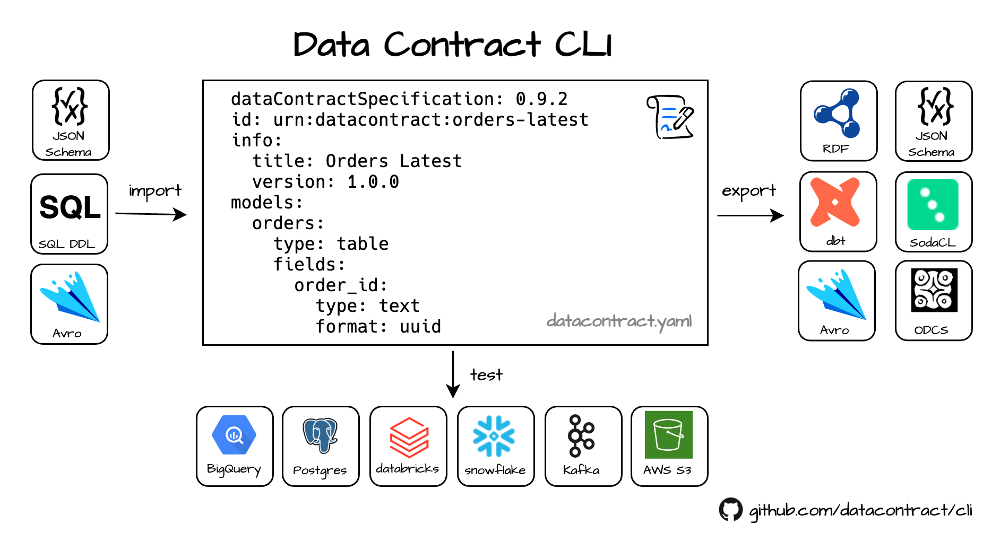

# Data Contract CLI

<p>
  <a href="https://github.com/datacontract/datacontract-cli/actions/workflows/ci.yaml?query=branch%3Amain">
    </a>
  <a href="https://pypi.org/project/datacontract-cli/">
    </a>
  <a href="https://github.com/datacontract/datacontract-cli">
    </a>
  <a href="https://datacontract.com/slack" rel="nofollow"></a>
</p>

The `datacontract` CLI is an open-source command-line tool for working with [data contracts](https://datacontract.com).
It natively supports the [Open Data Contract Standard](https://bitol-io.github.io/open-data-contract-standard/latest/) to lint data contracts, connect to data sources and execute schema and quality tests, and export to different formats. 
The tool is written in Python. 
It can be used as a standalone CLI tool, in a CI/CD pipeline, or directly as a Python library.



> **Quick navigation:** [Documentation](#documentation) · [Best Practices](#best-practices) · [Custom Export and Import](#customizing-exporters-and-importers) · [Development Setup](#development-setup)

## Getting started

Let's look at this data contract:
[https://datacontract.com/orders-v1.odcs.yaml](https://datacontract.com/orders-v1.odcs.yaml)

We have a _servers_ section with endpoint details to a Postgres database, _schema_ for the structure and semantics of the data, _service levels_ and _quality_ attributes that describe the expected freshness and number of rows.

This data contract contains all information to connect to the database and check that the actual data meets the defined schema specification and quality expectations.
We can use this information to test if the actual data product is compliant to the data contract.

Let's use [uv](https://docs.astral.sh/uv/) to install the CLI (or use the [Docker image](#docker)),
```bash
$ uv tool install --python python3.11 --upgrade 'datacontract-cli[all]'
```


Now, let's run the tests:

```bash
$ export DATACONTRACT_POSTGRES_USERNAME=datacontract_cli.egzhawjonpfweuutedfy
$ export DATACONTRACT_POSTGRES_PASSWORD=jio10JuQfDfl9JCCPdaCCpuZ1YO
$ datacontract test https://datacontract.com/orders-v1.odcs.yaml

# returns:
Testing https://datacontract.com/orders-v1.odcs.yaml
Server: production (type=postgres, host=aws-1-eu-central-2.pooler.supabase.com, port=6543, database=postgres, schema=dp_orders_v1)
╭────────┬──────────────────────────────────────────────────────────┬─────────────────────────┬─────────╮
│ Result │ Check                                                    │ Field                   │ Details │
├────────┼──────────────────────────────────────────────────────────┼─────────────────────────┼─────────┤
│ passed │ Check that field 'line_item_id' is present               │ line_items.line_item_id │         │
│ passed │ Check that field line_item_id has type UUID              │ line_items.line_item_id │         │
│ passed │ Check that field line_item_id has no missing values      │ line_items.line_item_id │         │
│ passed │ Check that field 'order_id' is present                   │ line_items.order_id     │         │
│ passed │ Check that field order_id has type UUID                  │ line_items.order_id     │         │
│ passed │ Check that field 'price' is present                      │ line_items.price        │         │
│ passed │ Check that field price has type INTEGER                  │ line_items.price        │         │
│ passed │ Check that field price has no missing values             │ line_items.price        │         │
│ passed │ Check that field 'sku' is present                        │ line_items.sku          │         │
│ passed │ Check that field sku has type TEXT                       │ line_items.sku          │         │
│ passed │ Check that field sku has no missing values               │ line_items.sku          │         │
│ passed │ Check that field 'customer_id' is present                │ orders.customer_id      │         │
│ passed │ Check that field customer_id has type TEXT               │ orders.customer_id      │         │
│ passed │ Check that field customer_id has no missing values       │ orders.customer_id      │         │
│ passed │ Check that field 'order_id' is present                   │ orders.order_id         │         │
│ passed │ Check that field order_id has type UUID                  │ orders.order_id         │         │
│ passed │ Check that field order_id has no missing values          │ orders.order_id         │         │
│ passed │ Check that unique field order_id has no duplicate values │ orders.order_id         │         │
│ passed │ Check that field 'order_status' is present               │ orders.order_status     │         │
│ passed │ Check that field order_status has type TEXT              │ orders.order_status     │         │
│ passed │ Check that field 'order_timestamp' is present            │ orders.order_timestamp  │         │
│ passed │ Check that field order_timestamp has type TIMESTAMPTZ    │ orders.order_timestamp  │         │
│ passed │ Check that field 'order_total' is present                │ orders.order_total      │         │
│ passed │ Check that field order_total has type INTEGER            │ orders.order_total      │         │
│ passed │ Check that field order_total has no missing values       │ orders.order_total      │         │
╰────────┴──────────────────────────────────────────────────────────┴─────────────────────────┴─────────╯
🟢 data contract is valid. Run 25 checks. Took 3.938887 seconds.
```

Voilà, the CLI tested that the YAML itself is valid, all records comply with the schema, and all quality attributes are met.

We can also use the data contract metadata to export in many [formats](#format), e.g., to generate a SQL DDL:

```bash
$ datacontract export --format sql https://datacontract.com/orders-v1.odcs.yaml

# returns:
-- Data Contract: orders
-- SQL Dialect: postgres
CREATE TABLE orders (
  order_id None not null primary key,
  customer_id text not null,
  order_total integer not null,
  order_timestamp None,
  order_status text
);
CREATE TABLE line_items (
  line_item_id None not null primary key,
  sku text not null,
  price integer not null,
  order_id None
);
```

Or generate an HTML export:

```bash
$ datacontract export --format html --output orders-v1.odcs.html https://datacontract.com/orders-v1.odcs.yaml
```

[//]: # (which will create this [HTML export]&#40;https://datacontract.com/examples/orders-latest/datacontract.html&#41;.)


## Usage

```bash
# create a new data contract from example and write it to odcs.yaml
$ datacontract init odcs.yaml

# lint the odcs.yaml and stop after the first validation error (default).
$ datacontract lint odcs.yaml

# show a changelog between two data contracts
$ datacontract changelog v1.odcs.yaml v2.odcs.yaml

# execute schema and quality checks (define credentials as environment variables)
$ datacontract test odcs.yaml

# export data contract as html (other formats: avro, dbt, dbt-sources, dbt-staging-sql, jsonschema, odcs, rdf, sql, sodacl, terraform, ...)
$ datacontract export --format html datacontract.yaml --output odcs.html

# import sql (other formats: avro, glue, bigquery, jsonschema, excel ...)
$ datacontract import --format sql --source my-ddl.sql --dialect postgres --output odcs.yaml

# import from Excel template
$ datacontract import --format excel --source odcs.xlsx --output odcs.yaml

# export to Excel template  
$ datacontract export --format excel --output odcs.xlsx odcs.yaml
```

## Programmatic (Python)
```python
from datacontract.data_contract import DataContract

data_contract = DataContract(data_contract_file="odcs.yaml")
run = data_contract.test()
if not run.has_passed():
    print("Data quality validation failed.")
    # Abort pipeline, alert, or take corrective actions...
```

## How to

- [How to integrate Data Contract CLI in your CI/CD pipeline as a GitHub Action](https://github.com/datacontract/datacontract-action/)
- [How to run the Data Contract CLI API to test data contracts with POST requests](https://cli.datacontract.com/API)
- [How to run Data Contract CLI in a Databricks pipeline](https://www.datamesh-architecture.com/howto/build-a-dataproduct-with-databricks#test-the-data-product)


## Installation

Choose the most appropriate installation method for your needs:

### uv

The preferred way to install is [uv](https://docs.astral.sh/uv/):

```
uv tool install --python python3.11 --upgrade 'datacontract-cli[all]'
```

### uvx

If you have [uv](https://docs.astral.sh/uv/) installed, you can run datacontract-cli directly without installing:

```
uv run --with 'datacontract-cli[all]' datacontract --version
```

### pip
Python 3.10, 3.11, and 3.12 are supported. We recommend using Python 3.11.

```bash
python3 -m pip install 'datacontract-cli[all]'
datacontract --version
```

### pip with venv

Typically it is better to install the application in a virtual environment for your projects:

```bash
cd my-project
python3.11 -m venv venv
source venv/bin/activate
pip install 'datacontract-cli[all]'
datacontract --version
```

### pipx

pipx installs into an isolated environment.

```bash
pipx install 'datacontract-cli[all]'
datacontract --version
```

### Docker

You can also use our Docker image to run the CLI tool. It is also convenient for CI/CD pipelines.

```bash
docker pull datacontract/cli
docker run --rm -v ${PWD}:/home/datacontract datacontract/cli
```

You can create an alias for the Docker command to make it easier to use:

```bash
alias datacontract='docker run --rm -v "${PWD}:/home/datacontract" datacontract/cli:latest'
```

_Note:_ The output of Docker command line messages is limited to 80 columns and may include line breaks. Don't pipe docker output to files if you want to export code. Use the `--output` option instead.


## Optional Dependencies (Extras)

The CLI tool defines several optional dependencies (also known as extras) that can be installed for using with specific servers types.
With _all_, all server dependencies are included.

```bash
uv tool install --python python3.11 --upgrade 'datacontract-cli[all]'
```

A list of available extras:

| Dependency              | Installation Command                       |
|-------------------------|--------------------------------------------|
| Amazon Athena           | `pip install datacontract-cli[athena]`     |
| Avro Support            | `pip install datacontract-cli[avro]`       |
| Google BigQuery         | `pip install datacontract-cli[bigquery]`   |
| Databricks Integration  | `pip install datacontract-cli[databricks]` |
| DuckDB (local/S3/GCS/Azure file testing) | `pip install datacontract-cli[duckdb]` |
| Iceberg                 | `pip install datacontract-cli[iceberg]`    |
| Kafka Integration       | `pip install datacontract-cli[kafka]`      |
| MySQL Integration       | `pip install datacontract-cli[mysql]`      |
| PostgreSQL Integration  | `pip install datacontract-cli[postgres]`   |
| S3 Integration          | `pip install datacontract-cli[s3]`         |
| Snowflake Integration   | `pip install datacontract-cli[snowflake]`  |
| Microsoft SQL Server    | `pip install datacontract-cli[sqlserver]`  |
| Trino                   | `pip install datacontract-cli[trino]`      |
| Impala                  | `pip install datacontract-cli[impala]` 	   |
| dbt                     | `pip install datacontract-cli[dbt]`        |
| DBML                    | `pip install datacontract-cli[dbml]`       |
| Parquet                 | `pip install datacontract-cli[parquet]`    |
| RDF                     | `pip install datacontract-cli[rdf]`        |
| API (run as web server) | `pip install datacontract-cli[api]`        |
| protobuf                | `pip install datacontract-cli[protobuf]`   |


## Documentation

Commands

- [init](#init)
- [lint](#lint)
- [changelog](#changelog)
- [test](#test)
- [ci](#ci)
- [export](#export)
- [import](#import)
- [catalog](#catalog)
- [publish](#publish)
- [api](#api)

### init
```
                                                                                                    
 Usage: datacontract init [OPTIONS] [LOCATION]                                                      
                                                                                                    
 Create an empty data contract.                                                                     
                                                                                                    
                                                                                                    
╭─ Arguments ──────────────────────────────────────────────────────────────────────────────────────╮
│   location      [LOCATION]  The location of the data contract file to create.                    │
│                             [default: datacontract.yaml]                                         │
╰──────────────────────────────────────────────────────────────────────────────────────────────────╯
╭─ Options ────────────────────────────────────────────────────────────────────────────────────────╮
│ --template                       TEXT  URL of a template or data contract [default: None]        │
│ --overwrite    --no-overwrite          Replace the existing datacontract.yaml                    │
│                                        [default: no-overwrite]                                   │
│ --debug        --no-debug              Enable debug logging [default: no-debug]                  │
│ --help                                 Show this message and exit.                               │
╰──────────────────────────────────────────────────────────────────────────────────────────────────╯

```

### lint
```
                                                                                
 Usage: datacontract lint [OPTIONS] [LOCATION]                                  
                                                                                
 Validate that the datacontract.yaml is correctly formatted.                    
                                                                                
╭─ Arguments ──────────────────────────────────────────────────────────────────╮
│   location      [LOCATION]  The location (url or path) of the data contract  │
│                             yaml.                                            │
│                             [default: datacontract.yaml]                     │
╰──────────────────────────────────────────────────────────────────────────────╯
╭─ Options ────────────────────────────────────────────────────────────────────╮
│ --schema                         TEXT          The location (url or path) of │
│                                                the ODCS JSON Schema          │
│ --output                         PATH          Specify the file path where   │
│                                                the test results should be    │
│                                                written to (e.g.,             │
│                                                './test-results/TEST-datacon… │
│                                                If no path is provided, the   │
│                                                output will be printed to     │
│                                                stdout.                       │
│ --output-format                  [json|junit]  The target format for the     │
│                                                test results.                 │
│ --all-errors                                   Report all JSON Schema        │
│                                                validation errors instead of  │
│                                                stopping after the first one. │
│ --debug            --no-debug                  Enable debug logging          │
│ --help                                         Show this message and exit.   │
╰──────────────────────────────────────────────────────────────────────────────╯

```

### changelog
```
                                                                                                    
 Usage: datacontract changelog [OPTIONS] V1 V2                                                      
                                                                                                    
 Show a changelog between two data contracts.                                                       
                                                                                                    
╭─ Arguments ──────────────────────────────────────────────────────────────────────────────────────╮
│ *    v1      TEXT  The location (path) of the source (before) data contract YAML. [required]     │
│ *    v2      TEXT  The location (path) of the target (after) data contract YAML. [required]      │
╰──────────────────────────────────────────────────────────────────────────────────────────────────╯
╭─ Options ────────────────────────────────────────────────────────────────────────────────────────╮
│ --debug     --no-debug                 Enable debug logging                                      │
│ --help                                 Show this message and exit.                               │
╰──────────────────────────────────────────────────────────────────────────────────────────────────╯

```

```bash
$ datacontract changelog v1.odcs.yaml v2.odcs.yaml
```

### test
```
                                                                                                    
 Usage: datacontract test [OPTIONS] [LOCATION]
                                                                                                    
 Run schema and quality tests on configured servers.                                                
                                                                                                    
                                                                                                    
╭─ Arguments ──────────────────────────────────────────────────────────────────────────────────────╮
│   location      [LOCATION]  The location (url or path) of the data contract yaml.                │
│                             [default: datacontract.yaml]                                         │
╰──────────────────────────────────────────────────────────────────────────────────────────────────╯
╭─ Options ────────────────────────────────────────────────────────────────────────────────────────╮
│ --schema                                               TEXT     The location (url or path) of    │
│                                                                 the ODCS JSON Schema             │
│                                                                 [default: None]                  │
│ --server                                               TEXT     The server configuration to run  │
│                                                                 the schema and quality tests.    │
│                                                                 Use the key of the server object │
│                                                                 in the data contract yaml file   │
│                                                                 to refer to a server, e.g.,      │
│                                                                 `production`, or `all` for all   │
│                                                                 servers (default).               │
│                                                                 [default: all]                   │
│ --publish-test-results    --no-publish-test-results             Deprecated. Use publish          │
│                                                                 parameter. Publish the results   │
│                                                                 after the test                   │
│                                                                 [default:                        │
│                                                                 no-publish-test-results]         │
│ --publish                                              TEXT     The url to publish the results   │
│                                                                 after the test.                  │
│                                                                 [default: None]                  │
│ --output                                               PATH     Specify the file path where the  │
│                                                                 test results should be written   │
│                                                                 to (e.g.,                        │
│                                                                 './test-results/TEST-datacontra… │
│                                                                 [default: None]                  │
│ --output-format                                        [junit]  The target format for the test   │
│                                                                 results.                         │
│                                                                 [default: None]                  │
│ --logs                    --no-logs                             Print logs [default: no-logs]    │
│ --ssl-verification        --no-ssl-verification                 SSL verification when publishing │
│                                                                 the data contract.               │
│                                                                 [default: ssl-verification]      │
│ --debug                   --no-debug                            Enable debug logging             │
│                                                                 [default: no-debug]              │
│ --help                                                          Show this message and exit.      │
╰──────────────────────────────────────────────────────────────────────────────────────────────────╯

```

Data Contract CLI connects to a data source and runs schema and quality tests to verify that the data contract is valid.

```bash
$ datacontract test --server production datacontract.yaml
```

For CI/CD pipelines, see [`ci`](#ci).

The application uses different engines, based on the server `type`.
Internally, it connects with DuckDB, Spark, or a native connection and executes the most tests with _soda-core_ and _fastjsonschema_.

#### Supported Data Sources

The `server` block in the datacontract.yaml is used to set up the connection.
In addition, credentials, such as username and passwords, are provided with environment variables.

Feel free to create an [issue](https://github.com/datacontract/datacontract-cli/issues), if you need support for additional types and formats.

<details markdown="1">
<summary><strong>S3</strong></summary>

Data Contract CLI can test data that is stored in S3 buckets or any S3-compliant endpoints in various formats.

- CSV
- JSON
- Delta
- Parquet
- Iceberg (coming soon)

##### Examples

###### JSON

datacontract.yaml
```yaml
servers:
  production:
    type: s3
    endpointUrl: https://minio.example.com # not needed with AWS S3
    location: s3://bucket-name/path/*/*.json
    format: json
    delimiter: new_line # new_line, array, or none
```

###### Delta Tables

datacontract.yaml
```yaml
servers:
  production:
    type: s3
    endpointUrl: https://minio.example.com # not needed with AWS S3
    location: s3://bucket-name/path/table.delta # path to the Delta table folder containing parquet data files and the _delta_log
    format: delta
```

##### Environment Variables

| Environment Variable                | Example                         | Description                            |
|-------------------------------------|---------------------------------|----------------------------------------|
| `DATACONTRACT_S3_REGION`            | `eu-central-1`                  | Region of S3 bucket                    |
| `DATACONTRACT_S3_ACCESS_KEY_ID`     | `AKIAXV5Q5QABCDEFGH`            | AWS Access Key ID                      |
| `DATACONTRACT_S3_SECRET_ACCESS_KEY` | `93S7LRrJcqLaaaa/XXXXXXXXXXXXX` | AWS Secret Access Key                  |
| `DATACONTRACT_S3_SESSION_TOKEN`     | `AQoDYXdzEJr...`                | AWS temporary session token (optional) |

</details>

<details markdown="1">
<summary><strong>Athena</strong></summary>

Data Contract CLI can test data in AWS Athena stored in S3.
Supports different file formats, such as Iceberg, Parquet, JSON, CSV...

##### Example

datacontract.yaml
```yaml
servers:
  athena:
    type: athena
    catalog: awsdatacatalog # awsdatacatalog is the default setting
    schema: icebergdemodb   # in Athena, this is called "database"
    regionName: eu-central-1
    stagingDir: s3://my-bucket/athena-results/
models:
  my_table: # corresponds to a table or view name
    type: table
    fields:
      my_column_1: # corresponds to a column
        type: string
        config:
          physicalType: varchar
```

##### Environment Variables

| Environment Variable                | Example                         | Description                            |
|-------------------------------------|---------------------------------|----------------------------------------|
| `DATACONTRACT_S3_REGION`            | `eu-central-1`                  | Region of Athena service               |
| `DATACONTRACT_S3_ACCESS_KEY_ID`     | `AKIAXV5Q5QABCDEFGH`            | AWS Access Key ID                      |
| `DATACONTRACT_S3_SECRET_ACCESS_KEY` | `93S7LRrJcqLaaaa/XXXXXXXXXXXXX` | AWS Secret Access Key                  |
| `DATACONTRACT_S3_SESSION_TOKEN`     | `AQoDYXdzEJr...`                | AWS temporary session token (optional) |

</details>

<details markdown="1">
<summary><strong>Google Cloud Storage (GCS)</strong></summary>

The [S3](#S3) integration also works with files on Google Cloud Storage through its [interoperability](https://cloud.google.com/storage/docs/interoperability).
Use `https://storage.googleapis.com` as the endpoint URL.

##### Example

datacontract.yaml
```yaml
servers:
  production:
    type: s3
    endpointUrl: https://storage.googleapis.com
    location: s3://bucket-name/path/*/*.json # use s3:// schema instead of gs://
    format: json
    delimiter: new_line # new_line, array, or none
```

##### Environment Variables

| Environment Variable                | Example        | Description                                                                              |
|-------------------------------------|----------------|------------------------------------------------------------------------------------------|
| `DATACONTRACT_S3_ACCESS_KEY_ID`     | `GOOG1EZZZ...` | The GCS [HMAC Key](https://cloud.google.com/storage/docs/authentication/hmackeys) Key ID |
| `DATACONTRACT_S3_SECRET_ACCESS_KEY` | `PDWWpb...`    | The GCS [HMAC Key](https://cloud.google.com/storage/docs/authentication/hmackeys) Secret |

</details>

<details markdown="1">
<summary><strong>BigQuery</strong></summary>

We support authentication to BigQuery using Service Account Key or Application Default Credentials (ADC). ADC supports Workload Identity Federation (WIF), GCE metadata server, and `gcloud auth application-default login`. The used Service Account should include the roles:
* BigQuery Job User
* BigQuery Data Viewer

When no `DATACONTRACT_BIGQUERY_ACCOUNT_INFO_JSON_PATH` is set, the CLI falls back to ADC/WIF automatically via Soda's `use_context_auth`.

##### Example

datacontract.yaml
```yaml
servers:
  production:
    type: bigquery
    project: datameshexample-product
    dataset: datacontract_cli_test_dataset
models:
  datacontract_cli_test_table: # corresponds to a BigQuery table
    type: table
    fields: ...
```

##### Environment Variables

| Environment Variable                         | Example                   | Description                                             |
|----------------------------------------------|---------------------------|---------------------------------------------------------|
| `DATACONTRACT_BIGQUERY_ACCOUNT_INFO_JSON_PATH` | `~/service-access-key.json` | Service Account key JSON file. If not set, ADC/WIF is used automatically. |
| `DATACONTRACT_BIGQUERY_IMPERSONATION_ACCOUNT` | `sa@project.iam.gserviceaccount.com` | Optional. Service account to impersonate. Works with both key file and ADC auth. |

</details>

<details markdown="1">
<summary><strong>Azure</strong></summary>

Data Contract CLI can test data that is stored in Azure Blob storage or Azure Data Lake Storage (Gen2) (ADLS) in various formats.

##### Example

datacontract.yaml
```yaml
servers:
  production:
    type: azure
    location: abfss://datameshdatabricksdemo.dfs.core.windows.net/inventory_events/*.parquet
    format: parquet
```

##### Environment Variables

Authentication works with an Azure Service Principal (SPN) aka App Registration with a secret.

| Environment Variable               | Example                                | Description                                          |
|------------------------------------|----------------------------------------|------------------------------------------------------|
| `DATACONTRACT_AZURE_TENANT_ID`     | `79f5b80f-10ff-40b9-9d1f-774b42d605fc` | The Azure Tenant ID                                  |
| `DATACONTRACT_AZURE_CLIENT_ID`     | `3cf7ce49-e2e9-4cbc-a922-4328d4a58622` | The ApplicationID / ClientID of the app registration |
| `DATACONTRACT_AZURE_CLIENT_SECRET` | `yZK8Q~GWO1MMXXXXXXXXXXXXX`            | The Client Secret value                              |

</details>

<details markdown="1">
<summary><strong>SQL Server</strong></summary>

Data Contract CLI can test data in MS SQL Server (including Azure SQL, Synapse Analytics SQL Pool, and Microsoft Fabric).

##### Example

datacontract.yaml
```yaml
servers:
  production:
    type: sqlserver
    host: localhost
    port: 5432
    database: tempdb
    schema: dbo
    driver: ODBC Driver 18 for SQL Server
models:
  my_table_1: # corresponds to a table
    type: table
    fields:
      my_column_1: # corresponds to a column
        type: varchar
```

##### Environment Variables

| Environment Variable                              | Example                         | Description                                                                                                                       |
|---------------------------------------------------|---------------------------------|-----------------------------------------------------------------------------------------------------------------------------------|
| `DATACONTRACT_SQLSERVER_AUTHENTICATION`           | `sql`                           | Supported: `sql` (default), `cli` (uses `az login` session), `windows`, `ActiveDirectoryPassword`, `ActiveDirectoryServicePrincipal`, `ActiveDirectoryInteractive` |
| `DATACONTRACT_SQLSERVER_USERNAME`                 | `root`                          | Username (for `sql`, `ActiveDirectoryPassword`, `ActiveDirectoryInteractive`)                                                     |
| `DATACONTRACT_SQLSERVER_PASSWORD`                 | `toor`                          | Password (for `sql` and `ActiveDirectoryPassword`)                                                                                |
| `DATACONTRACT_SQLSERVER_CLIENT_ID`                | `a3cf5d29-b1a7-...`             | Application/Client ID (for `ActiveDirectoryServicePrincipal`)                                                                     |
| `DATACONTRACT_SQLSERVER_CLIENT_SECRET`            | `kX9~Qr2Lm.Tz4W...`             | Client secret (for `ActiveDirectoryServicePrincipal`)                                                                             |
| `DATACONTRACT_SQLSERVER_TRUST_SERVER_CERTIFICATE` | `True`                          | Trust self-signed certificate                                                                                                     |
| `DATACONTRACT_SQLSERVER_ENCRYPTED_CONNECTION`     | `True`                          | Use SSL                                                                                                                           |
| `DATACONTRACT_SQLSERVER_DRIVER`                   | `ODBC Driver 18 for SQL Server` | ODBC driver name                                                                                                                  |
| `DATACONTRACT_SQLSERVER_TRUSTED_CONNECTION`       | `True`                          | Deprecated. Equivalent to `AUTHENTICATION=windows`                                                                                |

</details>

<details markdown="1">
<summary><strong>Oracle</strong></summary>

Data Contract CLI can test data in Oracle Database.

##### Example

datacontract.yaml
```yaml
servers:
  oracle:
    type: oracle
    host: localhost
    port: 1521
    service_name: ORCL
    schema: ADMIN
models:
  my_table_1: # corresponds to a table
    type: table
    fields:
      my_column_1: # corresponds to a column
        type: decimal
        description: Decimal number
      my_column_2: # corresponds to another column
        type: text
        description: Unicode text string
        config:
          oracleType: NVARCHAR2 # optional: can be used to explicitly define the type used in the database
                                # if not set a default mapping will be used
```

##### Environment Variables

These environment variable specify the credentials used by the datacontract tool to connect to the database.
If you've started the database from a container, e.g. [oracle-free](https://hub.docker.com/r/gvenzl/oracle-free)
this should match either `system` and what you specified as `ORACLE_PASSWORD` on the container or
alternatively what you've specified under `APP_USER` and `APP_USER_PASSWORD`.
If you require thick mode to connect to the database, you need to have an Oracle Instant Client
installed on the system and specify the path to the installation within the environment variable
`DATACONTRACT_ORACLE_CLIENT_DIR`.

| Environment Variable                             | Example            | Description                                |
|--------------------------------------------------|--------------------|--------------------------------------------|
| `DATACONTRACT_ORACLE_USERNAME`                   | `system`           | Username                                   |
| `DATACONTRACT_ORACLE_PASSWORD`                   | `0x162e53`         | Password                                   |
| `DATACONTRACT_ORACLE_CLIENT_DIR`                 | `C:\oracle\client` | Path to Oracle Instant Client installation |

</details>

<details markdown="1">
<summary><strong>Databricks</strong></summary>

Works with Unity Catalog and Hive metastore.

Needs a running SQL warehouse or compute cluster.

##### Example

datacontract.yaml
```yaml
servers:
  production:
    type: databricks
    catalog: acme_catalog_prod
    schema: orders_latest
models:
  orders: # corresponds to a table
    type: table
    fields: ...
```

##### Environment Variables

| Environment Variable                      | Example                              | Description                                               |
|-------------------------------------------|--------------------------------------|-----------------------------------------------------------|
| `DATACONTRACT_DATABRICKS_TOKEN`           | `dapia00000000000000000000000000000` | The personal access token to authenticate                 |
| `DATACONTRACT_DATABRICKS_HTTP_PATH`       | `/sql/1.0/warehouses/b053a3ffffffff` | The HTTP path to the SQL warehouse or compute cluster     |
| `DATACONTRACT_DATABRICKS_SERVER_HOSTNAME` | `dbc-abcdefgh-1234.cloud.databricks.com` | The host name of the SQL warehouse or compute cluster |

</details>

<details markdown="1">
<summary><strong>Databricks (programmatic)</strong></summary>

Works with Unity Catalog and Hive metastore.
When running in a notebook or pipeline, the provided `spark` session can be used.
An additional authentication is not required.

Requires a Databricks Runtime with Python >= 3.10.

##### Example

datacontract.yaml
```yaml
servers:
  production:
    type: databricks
    host: dbc-abcdefgh-1234.cloud.databricks.com # ignored, always use current host
    catalog: acme_catalog_prod
    schema: orders_latest
models:
  orders: # corresponds to a table
    type: table
    fields: ...
```

##### Installing on Databricks Compute

**Important:** When using Databricks LTS ML runtimes (15.4, 16.4), installing via `%pip install` in notebooks can cause issues.

**Recommended approach:** Use Databricks' native library management instead:

1. **Create or configure your compute cluster:**
   - Navigate to **Compute** in the Databricks workspace
   - Create a new cluster or select an existing one
   - Go to the **Libraries** tab

2. **Add the datacontract-cli library:**
   - Click **Install new**
   - Select **PyPI** as the library source
   - Enter package name: `datacontract-cli[databricks]`
   - Click **Install**

3. **Restart the cluster** to apply the library installation

4. **Use in your notebook** without additional installation:
   ```python
   from datacontract.data_contract import DataContract

   data_contract = DataContract(
     data_contract_file="/Volumes/acme_catalog_prod/orders_latest/datacontract/datacontract.yaml",
     spark=spark)
   run = data_contract.test()
   run.result
   ```

Databricks' library management properly resolves dependencies during cluster initialization, rather than at runtime in the notebook.

</details>

<details markdown="1">
<summary><strong>Dataframe (programmatic)</strong></summary>

Works with Spark DataFrames.
DataFrames need to be created as named temporary views.
Multiple temporary views are supported if your data contract contains multiple models.

Testing DataFrames is useful to test your datasets in a pipeline before writing them to a data source.

##### Example

datacontract.yaml
```yaml
servers:
  production:
    type: dataframe
models:
  my_table: # corresponds to a temporary view
    type: table
    fields: ...
```

Example code
```python
from datacontract.data_contract import DataContract

df.createOrReplaceTempView("my_table")

data_contract = DataContract(
  data_contract_file="datacontract.yaml",
  spark=spark,
)
run = data_contract.test()
assert run.result == "passed"
```

</details>

<details markdown="1">
<summary><strong>Snowflake</strong></summary>

Data Contract CLI can test data in Snowflake.

##### Example

datacontract.yaml
```yaml

servers:
  snowflake:
    type: snowflake
    account: abcdefg-xn12345
    database: ORDER_DB
    schema: ORDERS_PII_V2
models:
  my_table_1: # corresponds to a table
    type: table
    fields:
      my_column_1: # corresponds to a column
        type: varchar
```

##### Environment Variables
All [parameters supported by Soda](https://docs.soda.io/soda/connect-snowflake.html), uppercased and prepended by `DATACONTRACT_SNOWFLAKE_` prefix.
For example:

| Soda parameter       | Environment Variable                        |
|----------------------|---------------------------------------------|
| `username`           | `DATACONTRACT_SNOWFLAKE_USERNAME`           |
| `password`           | `DATACONTRACT_SNOWFLAKE_PASSWORD`           |
| `warehouse`          | `DATACONTRACT_SNOWFLAKE_WAREHOUSE`          |
| `role`               | `DATACONTRACT_SNOWFLAKE_ROLE`               |
| `connection_timeout` | `DATACONTRACT_SNOWFLAKE_CONNECTION_TIMEOUT` |

Beware, that parameters:
* `account`
* `database`
* `schema`

are obtained from the `servers` section of the YAML-file.
E.g. from the example above:
```yaml
servers:
  snowflake:
    account: abcdefg-xn12345
    database: ORDER_DB
    schema: ORDERS_PII_V2
```

</details>

<details markdown="1">
<summary><strong>Kafka</strong></summary>

Kafka support is currently considered experimental.

##### Example

datacontract.yaml
```yaml
servers:
  production:
    type: kafka
    host: abc-12345.eu-central-1.aws.confluent.cloud:9092
    topic: my-topic-name
    format: json
```

##### Environment Variables

| Environment Variable                | Example | Description                                                                      |
|-------------------------------------|---------|----------------------------------------------------------------------------------|
| `DATACONTRACT_KAFKA_SASL_USERNAME`  | `xxx`   | The SASL username (key).                                                         |
| `DATACONTRACT_KAFKA_SASL_PASSWORD`  | `xxx`   | The SASL password (secret).                                                      |
| `DATACONTRACT_KAFKA_SASL_MECHANISM` | `PLAIN` | Default `PLAIN`. Other supported mechanisms: `SCRAM-SHA-256` and `SCRAM-SHA-512` |

</details>

<details markdown="1">
<summary><strong>Postgres</strong></summary>

Data Contract CLI can test data in Postgres or Postgres-compliant databases (e.g., RisingWave).

##### Example

datacontract.yaml
```yaml
servers:
  postgres:
    type: postgres
    host: localhost
    port: 5432
    database: postgres
    schema: public
models:
  my_table_1: # corresponds to a table
    type: table
    fields:
      my_column_1: # corresponds to a column
        type: varchar
```

##### Environment Variables

| Environment Variable             | Example            | Description |
|----------------------------------|--------------------|-------------|
| `DATACONTRACT_POSTGRES_USERNAME` | `postgres`         | Username    |
| `DATACONTRACT_POSTGRES_PASSWORD` | `mysecretpassword` | Password    |

</details>

<details markdown="1">
<summary><strong>MySQL</strong></summary>

Data Contract CLI can test data in MySQL or MySQL-compliant databases (e.g., MariaDB).

##### Example

datacontract.yaml
```yaml
servers:
  mysql:
    type: mysql
    host: localhost
    port: 3306
    database: mydb
models:
  my_table_1: # corresponds to a table
    type: table
    fields:
      my_column_1: # corresponds to a column
        type: varchar
```

##### Environment Variables

| Environment Variable          | Example            | Description |
|-------------------------------|--------------------|-------------|
| `DATACONTRACT_MYSQL_USERNAME` | `root`             | Username    |
| `DATACONTRACT_MYSQL_PASSWORD` | `mysecretpassword` | Password    |

</details>

<details markdown="1">
<summary><strong>Trino</strong></summary>

Data Contract CLI can test data in Trino.

##### Example

datacontract.yaml
```yaml
servers:
  trino:
    type: trino
    host: localhost
    port: 8080
    catalog: my_catalog
    schema: my_schema
models:
  my_table_1: # corresponds to a table
    type: table
    fields:
      my_column_1: # corresponds to a column
        type: varchar
      my_column_2: # corresponds to a column with custom trino type
        type: object
        config:
          trinoType: row(en_us varchar, pt_br varchar)
```

##### Environment Variables

| Environment Variable          | Example            | Description |
|-------------------------------|--------------------|-------------|
| `DATACONTRACT_TRINO_USERNAME` | `trino`            | Username    |
| `DATACONTRACT_TRINO_PASSWORD` | `mysecretpassword` | Password    |

</details>

<details markdown="1">
<summary><strong>Impala</strong></summary>

Data Contract CLI can run Soda checks against an Apache Impala cluster.

##### Example

datacontract.yaml
```yaml
servers:
  impala:
    type: impala
    host: my-impala-host
    port: 443
    # Optional default database used for Soda scans
    database: my_database
models:
  my_table_1: # corresponds to a table
    type: table
    # fields as usual …
```

##### Environment Variables

| Environment Variable                      | Example               | Description                                               |
|-------------------------------            |--------------------   |-------------                                              |
| `DATACONTRACT_IMPALA_USERNAME`            | `analytics_user`      | Username used to connect to Impala                        |
| `DATACONTRACT_IMPALA_PASSWORD`            | `mysecretpassword`    | Password for the Impala user                              |
| `DATACONTRACT_IMPALA_USE_SSL`             | `true`                | Whether to use SSL; defaults to true if unset             |
| `DATACONTRACT_IMPALA_AUTH_MECHANISM`      | `LDAP`                | Authentication mechanism; defaults to LDAP                |
| `DATACONTRACT_IMPALA_USE_HTTP_TRANSPORT`  | `true`                | Whether to use the HTTP transport; defaults to true       |
| `DATACONTRACT_IMPALA_HTTP_PATH`           | `cliservice`          | HTTP path for the Impala service; defaults to cliservice  |

### Type-mapping note (logicalType → Impala type)

If `physicalType` is not specified in the schema, we recommend the following mapping from `logicalType` to Impala column types:

|logicalType | Recommended Impala type |
|------------|-------------------------|
| `integer`  | `INT` or `BIGINT`       |
| `number`   | `DOUBLE`/`decimal(..)`  |
| `string`   | `STRING` or `VARCHAR`   |
| `boolean`  | `BOOLEAN`               |
| `date`     | `DATE`                  |
| `datetime` | `TIMESTAMP`             |

This keeps the Impala schema compatible with the expectations of the Soda checks generated by datacontract-cli.

</details>

<details markdown="1">
<summary><strong>API</strong></summary>

Data Contract CLI can test APIs that return data in JSON format. 
Currently, only GET requests are supported.

##### Example

datacontract.yaml
```yaml
servers:
  api:
    type: "api"
    location: "https://api.example.com/path"
    delimiter: none # new_line, array, or none (default)

models:
  my_object: # corresponds to the root element of the JSON response
    type: object
    fields:
      field1: 
        type: string
      fields2: 
        type: number
```

##### Environment Variables

| Environment Variable                    | Example          | Description                                       |
|-----------------------------------------|------------------|---------------------------------------------------|
| `DATACONTRACT_API_HEADER_AUTHORIZATION` | `Bearer <token>` | The value for the `authorization` header. Optional. |

</details>

<details markdown="1">
<summary><strong>Local</strong></summary>

Data Contract CLI can test local files in parquet, json, csv, or delta format.

##### Example

datacontract.yaml
```yaml
servers:
  local:
    type: local
    path: ./*.parquet
    format: parquet
models:
  my_table_1: # corresponds to a table
    type: table
    fields:
      my_column_1: # corresponds to a column
        type: varchar
      my_column_2: # corresponds to a column
        type: string
```

</details>

### ci
```
                                                                                
 Usage: datacontract ci [OPTIONS] [LOCATIONS]...                                
                                                                                
 Run tests for CI/CD pipelines. Emits GitHub Actions annotations and step       
 summary.                                                                       
                                                                                
╭─ Arguments ──────────────────────────────────────────────────────────────────╮
│   locations      [LOCATIONS]...  The location(s) (url or path) of the data   │
│                                  contract yaml file(s).                      │
╰──────────────────────────────────────────────────────────────────────────────╯
╭─ Options ────────────────────────────────────────────────────────────────────╮
│ --schema                                   TEXT          The location (url   │
│                                                          or path) of the     │
│                                                          ODCS JSON Schema    │
│ --server                                   TEXT          The server          │
│                                                          configuration to    │
│                                                          run the schema and  │
│                                                          quality tests. Use  │
│                                                          the key of the      │
│                                                          server object in    │
│                                                          the data contract   │
│                                                          yaml file to refer  │
│                                                          to a server, e.g.,  │
│                                                          `production`, or    │
│                                                          `all` for all       │
│                                                          servers (default).  │
│                                                          [default: all]      │
│ --publish                                  TEXT          The url to publish  │
│                                                          the results after   │
│                                                          the test.           │
│ --output                                   PATH          Specify the file    │
│                                                          path where the test │
│                                                          results should be   │
│                                                          written to (e.g.,   │
│                                                          './test-results/TE… │
│ --output-format                            [json|junit]  The target format   │
│                                                          for the test        │
│                                                          results.            │
│ --logs                --no-logs                          Print logs          │
│                                                          [default: no-logs]  │
│ --json                --no-json                          Print test results  │
│                                                          as JSON to stdout.  │
│                                                          [default: no-json]  │
│ --fail-on                                  TEXT          Minimum severity    │
│                                                          that causes a       │
│                                                          non-zero exit code: │
│                                                          'warning', 'error', │
│                                                          or 'never'.         │
│                                                          [default: error]    │
│ --ssl-verification    --no-ssl-verific…                  SSL verification    │
│                                                          when publishing the │
│                                                          data contract.      │
│                                                          [default:           │
│                                                          ssl-verification]   │
│ --debug               --no-debug                         Enable debug        │
│                                                          logging             │
│ --help                                                   Show this message   │
│                                                          and exit.           │
╰──────────────────────────────────────────────────────────────────────────────╯

```

The `ci` command wraps [`test`](#test) with CI/CD-specific features:

- **Multiple contracts**: `datacontract ci contracts/*.yaml`
- **CI annotations:** Inline annotations for failed checks (GitHub Actions and Azure DevOps)
- **Markdown summary** of the test results (GitHub Actions)
- **`--json`**: Print test results as JSON to stdout for machine-readable output
- **`--fail-on`**: Control the minimum severity that causes a non-zero exit code. Default is `error`; set to `warning` to also fail on warnings, or `never` to always exit 0.

The [supported server types](#supported-data-sources) and their configuration are equivalent to the `test` command.

```bash
# Single contract
$ datacontract ci datacontract.yaml

# Multiple contracts
$ datacontract ci contracts/*.yaml

# Fail on warnings too
$ datacontract ci --fail-on warning datacontract.yaml

# JSON output for scripting
$ datacontract ci --json datacontract.yaml
```

<details markdown="1">
<summary>GitHub Actions workflow example</summary>

```yaml
# .github/workflows/datacontract.yml
name: Data Contract CI

on:
  push:
    branches: [main]
  pull_request:

jobs:
  datacontract-ci:
    runs-on: ubuntu-latest
    steps:
      - uses: actions/checkout@v4
      - uses: actions/setup-python@v5
        with:
          python-version: "3.11"
      - run: pip install datacontract-cli
      # Test one or more data contracts (supports globs, e.g. contracts/*.yaml)
      - run: datacontract ci datacontract.yaml
```

</details>

<details markdown="1">
<summary>Azure DevOps pipeline example</summary>

```yaml
# azure-pipelines.yml
trigger:
  branches:
    include:
      - main

pool:
  vmImage: "ubuntu-latest"

steps:
  - task: UsePythonVersion@0
    inputs:
      versionSpec: "3.11"
  - script: pip install datacontract-cli
    displayName: "Install datacontract-cli"
  # Test one or more data contracts (supports globs, e.g. contracts/*.yaml)
  - script: datacontract ci datacontract.yaml
    displayName: "Run data contract tests"
```

</details>


### export
```
                                                                                                    
 Usage: datacontract export [OPTIONS] [LOCATION]                                                    
                                                                                                    
 Convert data contract to a specific format. Saves to file specified by `output` option if present, 
 otherwise prints to stdout.                                                                        
                                                                                                    
                                                                                                    
╭─ Arguments ──────────────────────────────────────────────────────────────────────────────────────╮
│   location      [LOCATION]  The location (url or path) of the data contract yaml.                │
│                             [default: datacontract.yaml]                                         │
╰──────────────────────────────────────────────────────────────────────────────────────────────────╯
╭─ Options ────────────────────────────────────────────────────────────────────────────────────────╮
│ *  --format                       [jsonschema|pydantic-model|sod  The export format.             │
│                                   acl|dbt|dbt-sources|dbt-stagin  [default: None]                │
│                                   g-sql|odcs|rdf|avro|protobuf|g  [required]                     │
│                                   reat-expectations|avro-idl|sql                                 │
│                                   |sql-query|mermaid|html|go|big                                 │
│                                   query|dbml|spark|sqlalchemy|da                                 │
│                                   ta-caterer|dcs|markdown|iceber                                 │
│                                   g|custom|excel|dqx]                                            │
│    --output                       PATH                            Specify the file path where    │
│                                                                   the exported data will be      │
│                                                                   saved. If no path is provided, │
│                                                                   the output will be printed to  │
│                                                                   stdout.                        │
│                                                                   [default: None]                │
│    --server                       TEXT                            The server name to export.     │
│                                                                   [default: None]                │
│    --schema-name                  TEXT                            The name of the schema to      │
│                                                                   export, e.g., `orders`, or     │
│                                                                   `all` for all schemas          │
│                                                                   (default).                     │
│                                                                   [default: all]                 │
│    --schema                       TEXT                            The location (url or path) of  │
│                                                                   the ODCS JSON Schema           │
│                                                                   [default: None]                │
│    --engine                       TEXT                            [engine] The engine used for   │
│                                                                   great expection run.           │
│                                                                   [default: None]                │
│    --template                     PATH                            The file path or URL of a      │
│                                                                   template. For Excel format:    │
│                                                                   path/URL to custom Excel       │
│                                                                   template. For custom format:   │
│                                                                   path to Jinja template.        │
│                                                                   [default: None]                │
│    --debug          --no-debug                                    Enable debug logging           │
│                                                                   [default: no-debug]            │
│    --help                                                         Show this message and exit.    │
╰──────────────────────────────────────────────────────────────────────────────────────────────────╯
╭─ RDF Options ────────────────────────────────────────────────────────────────────────────────────╮
│ --rdf-base        TEXT  [rdf] The base URI used to generate the RDF graph. [default: None]       │
╰──────────────────────────────────────────────────────────────────────────────────────────────────╯
╭─ SQL Options ────────────────────────────────────────────────────────────────────────────────────╮
│ --sql-server-type        TEXT  [sql] The server type to determine the sql dialect. By default,   │
│                                it uses 'auto' to automatically detect the sql dialect via the    │
│                                specified servers in the data contract.                           │
│                                [default: auto]                                                   │
╰──────────────────────────────────────────────────────────────────────────────────────────────────╯

```

```bash
# Example export data contract as HTML
datacontract export --format html --output datacontract.html
```

Available export options:

| Type                 | Description                                             | Status  |
|----------------------|---------------------------------------------------------|---------|
| `html`               | Export to HTML                                          | ✅       |
| `jsonschema`         | Export to JSON Schema                                   | ✅       |
| `odcs`               | Export to Open Data Contract Standard (ODCS) V3         | ✅       |
| `sodacl`             | Export to SodaCL quality checks in YAML format          | ✅       |
| `dbt`                | Export to dbt models in YAML format                     | ✅       |
| `dbt-sources`        | Export to dbt sources in YAML format                    | ✅       |
| `dbt-staging-sql`    | Export to dbt staging SQL models                        | ✅       |
| `rdf`                | Export data contract to RDF representation in N3 format | ✅       |
| `avro`               | Export to AVRO models                                   | ✅       |
| `protobuf`           | Export to Protobuf                                      | ✅       |
| `terraform`          | Export to terraform resources                           | ✅       |
| `sql`                | Export to SQL DDL                                       | ✅       |
| `sql-query`          | Export to SQL Query                                     | ✅       |
| `great-expectations` | Export to Great Expectations Suites in JSON Format      | ✅       |
| `bigquery`           | Export to BigQuery Schemas                              | ✅       |
| `go`                 | Export to Go types                                      | ✅       |
| `pydantic-model`     | Export to pydantic models                               | ✅       |
| `DBML`               | Export to a DBML Diagram description                    | ✅       |
| `spark`              | Export to a Spark StructType                            | ✅       |
| `sqlalchemy`         | Export to SQLAlchemy Models                             | ✅       |
| `data-caterer`       | Export to Data Caterer in YAML format                   | ✅       |
| `dcs`                | Export to Data Contract Specification in YAML format    | ✅       |
| `markdown`           | Export to Markdown                                      | ✅       |
| `iceberg`            | Export to an Iceberg JSON Schema Definition             | partial |
| `excel`              | Export to ODCS Excel Template                           | ✅       |
| `custom`             | Export to Custom format with Jinja                      | ✅       |
| `dqx`                | Export to DQX in YAML format                            | ✅       |
| Missing something?   | Please create an issue on GitHub                        | TBD     |

#### SQL

The `export` function converts a given data contract into a SQL data definition language (DDL).

```shell
datacontract export datacontract.yaml --format sql --output output.sql
```

If using Databricks, and an error is thrown when trying to deploy the SQL DDLs with `variant` columns set the following properties.

```shell
spark.conf.set(“spark.databricks.delta.schema.typeCheck.enabled”, “false”)
```

#### Great Expectations

The `export` function transforms a specified data contract into a comprehensive Great Expectations JSON suite.
If the contract includes multiple models, you need to specify the names of the schema/models you wish to export.

```shell
datacontract export datacontract.yaml --format great-expectations --model orders
```

The export creates a list of expectations by utilizing:

- The data from the Model definition with a fixed mapping
- The expectations provided in the quality field for each model (find here the expectations gallery: [Great Expectations Gallery](https://greatexpectations.io/expectations/))

##### Additional Arguments

To further customize the export, the following optional arguments are available:

- **`suite_name`**: The name of the expectation suite. This suite groups all generated expectations and provides a convenient identifier within Great Expectations. If not provided, a default suite name will be generated based on the model name(s).

- **`engine`**: Specifies the engine used to run Great Expectations checks. Accepted values are:
  - `pandas` — Use this when working with in-memory data frames through the Pandas library.
  - `spark` — Use this for working with Spark dataframes.
  - `sql` — Use this for working with SQL databases.

- **`sql_server_type`**: Specifies the type of SQL server to connect with when `engine` is set to `sql`.

  Providing `sql_server_type` ensures that the appropriate SQL dialect and connection settings are applied during the expectation validation.

#### RDF

The `export` function converts a given data contract into a RDF representation. You have the option to
add a base_url which will be used as the default prefix to resolve relative IRIs inside the document.

```shell
datacontract export --format rdf --rdf-base https://www.example.com/ datacontract.yaml
```

The data contract is mapped onto the following concepts of a yet to be defined Data Contract
Ontology named https://datacontract.com/DataContractSpecification/ :
- DataContract
- Server
- Model

Having the data contract inside an RDF Graph gives us access the following use cases:
- Interoperability with other data contract specification formats
- Store data contracts inside a knowledge graph
- Enhance a semantic search to find and retrieve data contracts
- Linking model elements to already established ontologies and knowledge
- Using full power of OWL to reason about the graph structure of data contracts
- Apply graph algorithms on multiple data contracts (Find similar data contracts, find "gatekeeper"
data products, find the true domain owner of a field attribute)

#### DBML

The export function converts the logical data types of the datacontract into the specific ones of a concrete Database
if a server is selected via the `--server` option (based on the `type` of that server). If no server is selected, the
logical data types are exported.

#### DBT & DBT-SOURCES

The export function converts the datacontract to dbt models in YAML format, with support for SQL dialects.
If a server is selected via the `--server` option (based on the `type` of that server) then the DBT column `data_types` match the expected data types of the server.
If no server is selected, then it defaults to `snowflake`.

#### Spark

The export function converts the data contract specification into a StructType Spark schema. The returned value is a Python code picture of the model schemas.
Spark DataFrame schema is defined as StructType. For more details about Spark Data Types please see [the spark documentation](https://spark.apache.org/docs/latest/sql-ref-datatypes.html)

#### Avro

The export function converts the data contract specification into an avro schema. It supports specifying custom avro properties for logicalTypes and default values.

##### Custom Avro Properties

We support a **config map on field level**. A config map may include any additional key-value pairs and support multiple server type bindings.

To specify custom Avro properties in your data contract, you can define them within the `config` section of your field definition. Below is an example of how to structure your YAML configuration to include custom Avro properties, such as `avroLogicalType` and `avroDefault`.

>NOTE: At this moment, we just support [logicalType](https://avro.apache.org/docs/1.11.0/spec.html#Logical+Types) and [default](https://avro.apache.org/docs/1.11.0/spec.htm)

#### Example Configuration

```yaml
models:
  orders:
    fields:
      my_field_1:
        description: Example for AVRO with Timestamp (microsecond precision) https://avro.apache.org/docs/current/spec.html#Local+timestamp+%28microsecond+precision%29
        type: long
        example: 1672534861000000  # Equivalent to 2023-01-01 01:01:01 in microseconds
        required: true
        config:
          avroLogicalType: local-timestamp-micros
          avroDefault: 1672534861000000
```

#### Explanation

- **models**: The top-level key that contains different models (tables or objects) in your data contract.
- **orders**: A specific model name. Replace this with the name of your model.
- **fields**: The fields within the model. Each field can have various properties defined.
- **my_field_1**: The name of a specific field. Replace this with your field name.
  - **description**: A textual description of the field.
  - **type**: The data type of the field. In this example, it is `long`.
  - **example**: An example value for the field.
  - **required**: Is this a required field (as opposed to optional/nullable).
  - **config**: Section to specify custom Avro properties.
    - **avroLogicalType**: Specifies the logical type of the field in Avro. In this example, it is `local-timestamp-micros`.
    - **avroDefault**: Specifies the default value for the field in Avro. In this example, it is 1672534861000000 which corresponds to ` 2023-01-01 01:01:01 UTC`.

#### Data Caterer

The export function converts the data contract to a data generation task in YAML format that can be
ingested by [Data Caterer](https://github.com/data-catering/data-caterer). This gives you the
ability to generate production-like data in any environment based off your data contract.

```shell
datacontract export datacontract.yaml --format data-caterer --model orders
```

You can further customise the way data is generated via adding
[additional metadata in the YAML](https://data.catering/setup/generator/data-generator/)
to suit your needs.

#### Iceberg

Exports to an [Iceberg Table Json Schema Definition](https://iceberg.apache.org/spec/#appendix-c-json-serialization).

This export only supports a single model export at a time because Iceberg's schema definition is for a single table and the exporter maps 1 model to 1 table, use the `--model` flag
to limit your contract export to a single model.

```bash
 $ datacontract export --format iceberg --model orders https://datacontract.com/examples/orders-latest/datacontract.yaml --output /tmp/orders_iceberg.json
 
 $ cat /tmp/orders_iceberg.json | jq '.'
{
  "type": "struct",
  "fields": [
    {
      "id": 1,
      "name": "order_id",
      "type": "string",
      "required": true
    },
    {
      "id": 2,
      "name": "order_timestamp",
      "type": "timestamptz",
      "required": true
    },
    {
      "id": 3,
      "name": "order_total",
      "type": "long",
      "required": true
    },
    {
      "id": 4,
      "name": "customer_id",
      "type": "string",
      "required": false
    },
    {
      "id": 5,
      "name": "customer_email_address",
      "type": "string",
      "required": true
    },
    {
      "id": 6,
      "name": "processed_timestamp",
      "type": "timestamptz",
      "required": true
    }
  ],
  "schema-id": 0,
  "identifier-field-ids": [
    1
  ]
}
```

#### Custom

The export function converts the data contract specification into the custom format with Jinja. You can specify the path to a Jinja template with the `--template` argument, allowing you to output files in any format.

```shell
datacontract export --format custom --template template.txt datacontract.yaml
```

##### Jinja variables

You can directly use the Data Contract Specification as template variables.

```shell
$ cat template.txt
title: {{ data_contract.info.title }}

$ datacontract export --format custom --template template.txt datacontract.yaml
title: Orders Latest
```

##### Example Jinja Templates

###### Customized dbt model

You can export the dbt models containing any logic.

Below is an example of a dbt staging layer that converts a field of `type: timestamp` to a `DATETIME` type with time zone conversion.

template.sql


```sql

{#- Export only the first model #}

SELECT

  
  DATETIME({{ field_name }}, "Asia/Tokyo") AS {{ field_name }},
  
  {{ field_name }} AS {{ field_name }},
  

FROM
  {{ "{{" }} ref('{{ model_name }}') {{ "}}" }} 


```


command

```shell
datacontract export --format custom --template template.sql --output output.sql datacontract.yaml
```

output.sql

```sql
SELECT
  order_id AS order_id,
  DATETIME(order_timestamp, "Asia/Tokyo") AS order_timestamp,
  order_total AS order_total,
  customer_id AS customer_id,
  customer_email_address AS customer_email_address,
  DATETIME(processed_timestamp, "Asia/Tokyo") AS processed_timestamp,
FROM
  {{ ref('orders') }}
```

#### ODCS Excel Template

The `export` function converts a data contract into an ODCS (Open Data Contract Standard) Excel template. This creates a user-friendly Excel spreadsheet that can be used for authoring, sharing, and managing data contracts using the familiar Excel interface.

```shell
datacontract export --format excel --output datacontract.xlsx datacontract.yaml
```

The Excel format enables:
- **User-friendly authoring**: Create and edit data contracts in Excel's familiar interface
- **Easy sharing**: Distribute data contracts as standard Excel files
- **Collaboration**: Enable non-technical stakeholders to contribute to data contract definitions
- **Round-trip conversion**: Import Excel templates back to YAML data contracts

For more information about the Excel template structure, visit the [ODCS Excel Template repository](https://github.com/datacontract/open-data-contract-standard-excel-template).

### import
```
                                                                                                    
 Usage: datacontract import [OPTIONS]                                                               
                                                                                                    
 Create a data contract from the given source location. Saves to file specified by `output` option  
 if present, otherwise prints to stdout.                                                            
                                                                                                    
                                                                                                    
╭─ Options ────────────────────────────────────────────────────────────────────────────────────────╮
│ *  --format                                 [sql|avro|dbt|dbml|glue|  The format of the source   │
│                                             jsonschema|json|bigquery  file.                      │
│                                             |odcs|unity|spark|iceber  [default: None]            │
│                                             g|parquet|csv|protobuf|e  [required]                 │
│                                             xcel]                                                │
│    --output                                 PATH                      Specify the file path      │
│                                                                       where the Data Contract    │
│                                                                       will be saved. If no path  │
│                                                                       is provided, the output    │
│                                                                       will be printed to stdout. │
│                                                                       [default: None]            │
│    --source                                 TEXT                      The path to the file that  │
│                                                                       should be imported.        │
│                                                                       [default: None]            │
│    --dialect                                TEXT                      The SQL dialect to use     │
│                                                                       when importing SQL files,  │
│                                                                       e.g., postgres, tsql,      │
│                                                                       bigquery.                  │
│                                                                       [default: None]            │
│    --glue-table                             TEXT                      List of table ids to       │
│                                                                       import from the Glue       │
│                                                                       Database (repeat for       │
│                                                                       multiple table ids, leave  │
│                                                                       empty for all tables in    │
│                                                                       the dataset).              │
│                                                                       [default: None]            │
│    --bigquery-project                       TEXT                      The bigquery project id.   │
│                                                                       [default: None]            │
│    --bigquery-dataset                       TEXT                      The bigquery dataset id.   │
│                                                                       [default: None]            │
│    --bigquery-table                         TEXT                      List of table ids to       │
│                                                                       import from the bigquery   │
│                                                                       API (repeat for multiple   │
│                                                                       table ids, leave empty for │
│                                                                       all tables in the          │
│                                                                       dataset).                  │
│                                                                       [default: None]            │
│    --unity-table-full-name                  TEXT                      Full name of a table in    │
│                                                                       the unity catalog          │
│                                                                       [default: None]            │
│    --dbt-model                              TEXT                      List of models names to    │
│                                                                       import from the dbt        │
│                                                                       manifest file (repeat for  │
│                                                                       multiple models names,     │
│                                                                       leave empty for all models │
│                                                                       in the dataset).           │
│                                                                       [default: None]            │
│    --dbml-schema                            TEXT                      List of schema names to    │
│                                                                       import from the DBML file  │
│                                                                       (repeat for multiple       │
│                                                                       schema names, leave empty  │
│                                                                       for all tables in the      │
│                                                                       file).                     │
│                                                                       [default: None]            │
│    --dbml-table                             TEXT                      List of table names to     │
│                                                                       import from the DBML file  │
│                                                                       (repeat for multiple table │
│                                                                       names, leave empty for all │
│                                                                       tables in the file).       │
│                                                                       [default: None]            │
│    --iceberg-table                          TEXT                      Table name to assign to    │
│                                                                       the model created from the │
│                                                                       Iceberg schema.            │
│                                                                       [default: None]            │
│    --template                               TEXT                      The location (url or path) │
│                                                                       of the ODCS template       │
│                                                                       [default: None]            │
│    --schema                                 TEXT                      The location (url or path) │
│                                                                       of the ODCS JSON Schema    │
│                                                                       [default: None]            │
│    --owner                                  TEXT                      The owner or team          │
│                                                                       responsible for managing   │
│                                                                       the data contract.         │
│                                                                       [default: None]            │
│    --id                                     TEXT                      The identifier for the the │
│                                                                       data contract.             │
│                                                                       [default: None]            │
│    --debug                    --no-debug                              Enable debug logging       │
│                                                                       [default: no-debug]        │
│    --help                                                             Show this message and      │
│                                                                       exit.                      │
╰──────────────────────────────────────────────────────────────────────────────────────────────────╯

```

Example:
```bash
# Example import from SQL DDL
datacontract import --format sql --source my_ddl.sql --dialect postgres
# To save to file
datacontract import --format sql --source my_ddl.sql --dialect postgres --output datacontract.yaml
```

Available import options:

| Type               | Description                                   | Status  |
|--------------------|-----------------------------------------------|---------|
| `avro`             | Import from AVRO schemas                      | ✅       |
| `bigquery`         | Import from BigQuery Schemas                  | ✅       |
| `csv`              | Import from CSV File                          | ✅       |
| `dbml`             | Import from DBML models                       | ✅       |
| `dbt`              | Import from dbt models                        | ✅       |
| `excel`            | Import from ODCS Excel Template               | ✅       |
| `glue`             | Import from AWS Glue DataCatalog              | ✅       |
| `iceberg`          | Import from an Iceberg JSON Schema Definition | partial |
| `jsonschema`       | Import from JSON Schemas                      | ✅       |
| `parquet`          | Import from Parquet File Metadata             | ✅       |
| `protobuf`         | Import from Protobuf schemas                  | ✅       |
| `spark`            | Import from Spark StructTypes, Variant        | ✅       |
| `sql`              | Import from SQL DDL                           | ✅       |
| `unity`            | Import from Databricks Unity Catalog          | partial |
| Missing something? | Please create an issue on GitHub              | TBD     |


#### BigQuery

BigQuery data can either be imported off of JSON Files generated from the table descriptions or directly from the Bigquery API. In case you want to use JSON Files, specify the `source` parameter with a path to the JSON File.

To import from the Bigquery API, you have to _omit_ `source` and instead need to provide `bigquery-project` and `bigquery-dataset`. Additionally you may specify `bigquery-table` to enumerate the tables that should be imported. If no tables are given, _all_ available tables of the dataset will be imported.

For providing authentication to the Client, please see [the google documentation](https://cloud.google.com/docs/authentication/provide-credentials-adc#how-to) or the one [about authorizing client libraries](https://cloud.google.com/bigquery/docs/authentication#client-libs).

Examples:

```bash
# Example import from Bigquery JSON
datacontract import --format bigquery --source my_bigquery_table.json
```

```bash
# Example import from Bigquery API with specifying the tables to import
datacontract import --format bigquery --bigquery-project <project_id> --bigquery-dataset <dataset_id> --bigquery-table <tableid_1> --bigquery-table <tableid_2> --bigquery-table <tableid_3>
```

```bash
# Example import from Bigquery API importing all tables in the dataset
datacontract import --format bigquery --bigquery-project <project_id> --bigquery-dataset <dataset_id>
```

#### Unity Catalog
```bash
# Example import from a Unity Catalog JSON file
datacontract import --format unity --source my_unity_table.json
```

```bash
# Example import single table from Unity Catalog via HTTP endpoint using PAT
export DATACONTRACT_DATABRICKS_SERVER_HOSTNAME="https://xyz.cloud.databricks.com"
export DATACONTRACT_DATABRICKS_TOKEN=<token>
datacontract import --format unity --unity-table-full-name <table_full_name>
```
 Please refer to [Databricks documentation](https://docs.databricks.com/aws/en/dev-tools/auth/unified-auth) on how to set up a profile
```bash
# Example import single table from Unity Catalog via HTTP endpoint using Profile
export DATACONTRACT_DATABRICKS_PROFILE="my-profile"
datacontract import --format unity --unity-table-full-name <table_full_name>
```

#### dbt

Importing from dbt manifest file.
You may give the `dbt-model` parameter to enumerate the tables that should be imported. If no tables are given, _all_ available tables of the database will be imported.

Examples:

```bash
# Example import from dbt manifest with specifying the tables to import
datacontract import --format dbt --source <manifest_path> --dbt-model <model_name_1> --dbt-model <model_name_2> --dbt-model <model_name_3>
```

```bash
# Example import from dbt manifest importing all tables in the database
datacontract import --format dbt --source <manifest_path>
```

#### Excel

Importing from [ODCS Excel Template](https://github.com/datacontract/open-data-contract-standard-excel-template).

Examples:

```bash
# Example import from ODCS Excel Template
datacontract import --format excel --source odcs.xlsx
```

#### Glue

Importing from Glue reads the necessary Data directly off of the AWS API.
You may give the `glue-table` parameter to enumerate the tables that should be imported. If no tables are given, _all_ available tables of the database will be imported.

Examples:

```bash
# Example import from AWS Glue with specifying the tables to import
datacontract import --format glue --source <database_name> --glue-table <table_name_1> --glue-table <table_name_2> --glue-table <table_name_3>
```

```bash
# Example import from AWS Glue importing all tables in the database
datacontract import --format glue --source <database_name>
```

#### Spark

Importing from Spark table or view these must be created or accessible in the Spark context. Specify tables list in `source` parameter.  If the `source` tables are registered as tables in Databricks, and they have a table-level descriptions they will also be added to the Data Contract Specification.

```bash
# Example: Import Spark table(s) from Spark context
datacontract import --format spark --source "users,orders"
```

```bash
# Example: Import Spark table
DataContract.import_from_source("spark", "users")
DataContract.import_from_source(format = "spark", source = "users")

# Example: Import Spark dataframe
DataContract.import_from_source("spark", "users", dataframe = df_user)
DataContract.import_from_source(format = "spark", source = "users", dataframe = df_user)

# Example: Import Spark table + table description
DataContract.import_from_source("spark", "users", description = "description") 
DataContract.import_from_source(format = "spark", source = "users", description = "description")

# Example: Import Spark dataframe + table description
DataContract.import_from_source("spark", "users", dataframe = df_user, description = "description")
DataContract.import_from_source(format = "spark", source = "users", dataframe = df_user, description = "description")
```

#### DBML

Importing from DBML Documents.
**NOTE:** Since DBML does _not_ have strict requirements on the types of columns, this import _may_ create non-valid datacontracts, as not all types of fields can be properly mapped. In this case you will have to adapt the generated document manually.
We also assume, that the description for models and fields is stored in a Note within the DBML model.

You may give the `dbml-table` or `dbml-schema` parameter to enumerate the tables or schemas that should be imported. 
If no tables are given, _all_ available tables of the source will be imported. Likewise, if no schema is given, _all_ schemas are imported.

Examples:

```bash
# Example import from DBML file, importing everything
datacontract import --format dbml --source <file_path>
```

```bash
# Example import from DBML file, filtering for tables from specific schemas
datacontract import --format dbml --source <file_path> --dbml-schema <schema_1> --dbml-schema <schema_2>
```

```bash
# Example import from DBML file, filtering for tables with specific names
datacontract import --format dbml --source <file_path> --dbml-table <table_name_1> --dbml-table <table_name_2>
```

```bash
# Example import from DBML file, filtering for tables with specific names from a specific schema
datacontract import --format dbml --source <file_path> --dbml-table <table_name_1> --dbml-schema <schema_1>
```

#### Iceberg

Importing from an [Iceberg Table Json Schema Definition](https://iceberg.apache.org/spec/#appendix-c-json-serialization). Specify location of json files using the `source` parameter.

Examples:

```bash
datacontract import --format iceberg --source ./tests/fixtures/iceberg/simple_schema.json --iceberg-table test-table
```

#### CSV

Importing from CSV File. Specify file in `source` parameter. It does autodetection for encoding and csv dialect

Example:

```bash
datacontract import --format csv --source "test.csv"
```

#### protobuf

Importing from protobuf File. Specify file in `source` parameter. 

Example:

```bash
datacontract import --format protobuf --source "test.proto"
```


### catalog
```
                                                                                                    
 Usage: datacontract catalog [OPTIONS]                                                              
                                                                                                    
 Create a html catalog of data contracts.                                                           
                                                                                                    
                                                                                                    
╭─ Options ────────────────────────────────────────────────────────────────────────────────────────╮
│ --files                   TEXT  Glob pattern for the data contract files to include in the       │
│                                 catalog. Applies recursively to any subfolders.                  │
│                                 [default: *.yaml]                                                │
│ --output                  TEXT  Output directory for the catalog html files. [default: catalog/] │
│ --schema                  TEXT  The location (url or path) of the ODCS JSON Schema               │
│                                 [default: None]                                                  │
│ --debug     --no-debug          Enable debug logging [default: no-debug]                         │
│ --help                          Show this message and exit.                                      │
╰──────────────────────────────────────────────────────────────────────────────────────────────────╯

```

Examples:

```
# create a catalog right in the current folder
datacontract catalog --output "."

# Create a catalog based on a filename convention
datacontract catalog --files "*.odcs.yaml"
```

### publish
```
                                                                                                    
 Usage: datacontract publish [OPTIONS] [LOCATION]                                                   
                                                                                                    
 Publish the data contract to the Entropy Data.                                                     
                                                                                                    
                                                                                                    
╭─ Arguments ──────────────────────────────────────────────────────────────────────────────────────╮
│   location      [LOCATION]  The location (url or path) of the data contract yaml.                │
│                             [default: datacontract.yaml]                                         │
╰──────────────────────────────────────────────────────────────────────────────────────────────────╯
╭─ Options ────────────────────────────────────────────────────────────────────────────────────────╮
│ --schema                                       TEXT  The location (url or path) of the ODCS JSON │
│                                                      Schema                                      │
│                                                      [default: None]                             │
│ --ssl-verification    --no-ssl-verification          SSL verification when publishing the data   │
│                                                      contract.                                   │
│                                                      [default: ssl-verification]                 │
│ --debug               --no-debug                     Enable debug logging [default: no-debug]    │
│ --help                                               Show this message and exit.                 │
╰──────────────────────────────────────────────────────────────────────────────────────────────────╯

```

### api
```
                                                                                                    
 Usage: datacontract api [OPTIONS]                                                                  
                                                                                                    
 Start the datacontract CLI as server application with REST API.                                    
                                                                                                    
 The OpenAPI documentation as Swagger UI is available on http://localhost:4242. You can execute the 
 commands directly from the Swagger UI.                                                             
 To protect the API, you can set the environment variable DATACONTRACT_CLI_API_KEY to a secret API  
 key. To authenticate, requests must include the header 'x-api-key' with the correct API key. This  
 is highly recommended, as data contract tests may be subject to SQL injections or leak sensitive   
 information.                                                                                       
 To connect to servers (such as a Snowflake data source), set the credentials as environment        
 variables as documented in https://cli.datacontract.com/#test                                      
 It is possible to run the API with extra arguments for `uvicorn.run()` as keyword arguments, e.g.: 
 `datacontract api --port 1234 --root_path /datacontract`.                                          
                                                                                                    
╭─ Options ────────────────────────────────────────────────────────────────────────────────────────╮
│ --port                   INTEGER  Bind socket to this port. [default: 4242]                      │
│ --host                   TEXT     Bind socket to this host. Hint: For running in docker, set it  │
│                                   to 0.0.0.0                                                     │
│                                   [default: 127.0.0.1]                                           │
│ --debug    --no-debug             Enable debug logging [default: no-debug]                       │
│ --help                            Show this message and exit.                                    │
╰──────────────────────────────────────────────────────────────────────────────────────────────────╯

```

## Integrations

| Integration           | Option                       | Description                                                                                                   |
|-----------------------|------------------------------|---------------------------------------------------------------------------------------------------------------|
| Entropy Data          | `--publish`                  | Push full results to the [Entropy Data API](https://api.entropy-data.com/swagger/index.html)                  |

### Integration with Entropy Data

If you use [Entropy Data](https://entropy-data.com/), you can use the data contract URL to reference to the contract and append the `--publish` option to send and display the test results. Set an environment variable for your API key.

```bash
# Fetch current data contract, execute tests on production, and publish result to entropy data
$ EXPORT ENTROPY_DATA_API_KEY=xxx
$ datacontract test https://demo.entropy-data.com/demo279750347121/datacontracts/4df9d6ee-e55d-4088-9598-b635b2fdcbbc/datacontract.yaml \
 --server production \
 --publish https://api.entropy-data.com/api/test-results
```

## Best Practices

We share best practices in using the Data Contract CLI.

### Data-first Approach

Create a data contract based on the actual data. This is the fastest way to get started and to get feedback from the data consumers.

1. Use an existing physical schema (e.g., SQL DDL) as a starting point to define your logical data model in the contract. Double check right after the import whether the actual data meets the imported logical data model. Just to be sure.
    ```bash
    $ datacontract import --format sql --source ddl.sql
    $ datacontract test
    ```

2. Add quality checks and additional type constraints one by one to the contract and make sure the
   data still adheres to the contract.
   ```bash
   $ datacontract test
   ```

3. Validate that the `datacontract.yaml` is correctly formatted and adheres to the Data Contract Specification.
   ```bash
   $ datacontract lint
   ```

4. Set up a CI pipeline that executes daily for continuous quality checks. Use the [`ci`](#ci) command for
   CI-optimized output (GitHub Actions annotations and step summary, Azure DevOps annotations).
   You can also report the test results to tools like [Data Mesh Manager](https://datamesh-manager.com).
   ```bash
   $ datacontract ci --publish https://api.datamesh-manager.com/api/test-results
   ```

### Contract-First

Create a data contract based on the requirements from use cases.

1. Start with a `datacontract.yaml` template.
   ```bash
   $ datacontract init
   ```

2. Create the model and quality guarantees based on your business requirements. Fill in the terms,
   descriptions, etc. Validate that your `datacontract.yaml` is correctly formatted.
    ```bash
    $ datacontract lint
    ```

3. Use the export function to start building the providing data product as well as the integration
   into the consuming data products.
    ```bash
    # data provider
    $ datacontract export --format dbt
    # data consumer
    $ datacontract export --format dbt-sources
    $ datacontract export --format dbt-staging-sql
    ```

4. Test that your data product implementation adheres to the contract.
    ```bash
    $ datacontract test
    ```


## Customizing Exporters and Importers

### Custom Exporter
Using the exporter factory to add a new custom exporter
```python

from datacontract.data_contract import DataContract
from datacontract.export.exporter import Exporter
from datacontract.export.exporter_factory import exporter_factory


# Create a custom class that implements export method
class CustomExporter(Exporter):
    def export(self, data_contract, model, server, sql_server_type, export_args) -> dict:
        result = {
            "title": data_contract.info.title,
            "version": data_contract.info.version,
            "description": data_contract.info.description,
            "email": data_contract.info.contact.email,
            "url": data_contract.info.contact.url,
            "model": model,
            "model_columns": ", ".join(list(data_contract.models.get(model).fields.keys())),
            "export_args": export_args,
            "custom_args": export_args.get("custom_arg", ""),
        }
        return result


# Register the new custom class into factory
exporter_factory.register_exporter("custom_exporter", CustomExporter)


if __name__ == "__main__":
    # Create a DataContract instance
    data_contract = DataContract(
        data_contract_file="/path/datacontract.yaml"
    )
    # Call export
    result = data_contract.export(
        export_format="custom_exporter", model="orders", server="production", custom_arg="my_custom_arg"
    )
    print(result)

```
Output
```python
{
 'title': 'Orders Unit Test',
 'version': '1.0.0',
 'description': 'The orders data contract',
 'email': 'team-orders@example.com',
 'url': 'https://wiki.example.com/teams/checkout',
 'model': 'orders',
 'model_columns': 'order_id, order_total, order_status',
 'export_args': {'server': 'production', 'custom_arg': 'my_custom_arg'},
 'custom_args': 'my_custom_arg'
}
```

### Custom Importer
Using the importer factory to add a new custom importer
```python

from datacontract.model.data_contract_specification import DataContractSpecification, Field, Model
from datacontract.data_contract import DataContract
from datacontract.imports.importer import Importer
from datacontract.imports.importer_factory import importer_factory

import json

# Create a custom class that implements import_source method
class CustomImporter(Importer):
    def import_source(
        self, data_contract_specification: DataContractSpecification, source: str, import_args: dict
    ) -> dict:
        source_dict = json.loads(source)
        data_contract_specification.id = source_dict.get("id_custom")
        data_contract_specification.info.title = source_dict.get("title")
        data_contract_specification.info.version = source_dict.get("version")
        data_contract_specification.info.description = source_dict.get("description_from_app")

        for model in source_dict.get("models", []):
            fields = {}
            for column in model.get('columns'):
                field = Field(
                    description=column.get('column_description'),
                    type=column.get('type')
                )
                fields[column.get('name')] = field

            dc_model = Model(
                description=model.get('description'),
                fields= fields
            )

            data_contract_specification.models[model.get('name')] = dc_model
        return data_contract_specification


# Register the new custom class into factory
importer_factory.register_importer("custom_company_importer", CustomImporter)


if __name__ == "__main__":
    # Get a custom data from other app
    json_from_custom_app = '''
    {
        "id_custom": "uuid-custom",
        "version": "0.0.2",
        "title": "my_custom_imported_data",
        "description_from_app": "Custom contract description",
        "models": [
            {
            "name": "model1",
            "description": "model description from app",
            "columns": [
                {
                "name": "columnA",
                "type": "varchar",
                "column_description": "my_column description"
                },
                {
                "name": "columnB",
                "type": "varchar",
                "column_description": "my_columnB description"
                }
            ]
            }
        ]
        }
    '''
    # Create a DataContract instance
    data_contract = DataContract()

    # Call import_from_source
    result = data_contract.import_from_source(
        format="custom_company_importer",
        data_contract_specification=DataContract.init(),
        source=json_from_custom_app
    )
    print(result.to_yaml() )
```
Output

```yaml
dataContractSpecification: 1.2.1
id: uuid-custom
info:
  title: my_custom_imported_data
  version: 0.0.2
  description: Custom contract description
models:
  model1:
    fields:
      columnA:
        type: varchar
        description: my_column description
      columnB:
        type: varchar
        description: my_columnB description

```
## Development Setup

- Install [uv](https://docs.astral.sh/uv/)
- Python base interpreter should be 3.11.x.
- Docker engine must be running to execute the tests.

```bash
# make sure uv is installed
uv python pin 3.11
uv venv
uv pip install -e '.[dev]'
uv run ruff check
uv run pytest
```

## Contribution

We are happy to receive your contributions. Propose your change in an issue or directly create a
pull request with your improvements.

Before creating a pull request, please make sure that all tests are passing (`uv run pytest`) and
your code is properly formatted (`ruff format`). Create a changelog entry and reference fixed
issues (if any).

### Troubleshooting

#### Windows: Some tests fail

Run in WSL. (We need to fix the paths in the tests so that normal Windows will work, contributions are appreciated)

#### PyCharm does not pick up the `.venv` 

This [uv issue](https://github.com/astral-sh/uv/issues/12545) might be relevant.

Try to sync all groups:

```
uv sync --all-groups --all-extras
```

#### Errors in tests that use PySpark (e.g. test_test_kafka.py)

Ensure you have a JDK 17 or 21 installed. Java 25 causes issues.

```
java --version
```


### Docker Build

```bash
docker build -t datacontract/cli .
docker run --rm -v ${PWD}:/home/datacontract datacontract/cli
```

#### Docker compose integration

We've included a [docker-compose.yml](./docker-compose.yml) configuration to simplify the build, test, and deployment of the image.

##### Building the Image with Docker Compose

To build the Docker image using Docker Compose, run the following command:

```bash
docker compose build
```

This command utilizes the `docker-compose.yml` to build the image, leveraging predefined settings such as the build context and Dockerfile location. This approach streamlines the image creation process, avoiding the need for manual build specifications each time.

#### Testing the Image

After building the image, you can test it directly with Docker Compose:

```bash
docker compose run --rm datacontract --version
```

This command runs the container momentarily to check the version of the `datacontract` CLI. The `--rm` flag ensures that the container is automatically removed after the command executes, keeping your environment clean.


## Release Steps

1. Update the version in `pyproject.toml`
2. Have a look at the `CHANGELOG.md`
3. Create release commit manually
4. Execute `./release`
5. Wait until GitHub Release is created
6. Add the release notes to the GitHub Release

## Companies using this tool

- [Entropy Data](https://www.entropy-data.com)
- [INNOQ](https://innoq.com)
- [Data Catering](https://data.catering/)
- [Oliver Wyman](https://www.oliverwyman.com/)
- And many more. To add your company, please create a pull request.

## Related Tools

- [Entropy Data](https://www.entropy-data.com/) is a commercial tool to manage data contracts. It contains a web UI, access management, and data governance for a data product marketplace based on data contracts.
- [Data Contract Editor](https://editor.datacontract.com) is an editor for Data Contracts, including a live html preview.
- [Data Contract Playground](https://data-catering.github.io/data-contract-playground/) allows you to validate and export your data contract to different formats within your browser.

## License

[MIT License](LICENSE)

## Credits

Created by [Stefan Negele](https://www.linkedin.com/in/stefan-negele-573153112/), [Jochen Christ](https://www.linkedin.com/in/jochenchrist/), and [Simon Harrer]().


<a href="https://github.com/datacontract/datacontract-cli" class="github-corner" aria-label="View source on GitHub"><svg width="80" height="80" viewBox="0 0 250 250" style="fill:#151513; color:#fff; position: absolute; top: 0; border: 0; right: 0;" aria-hidden="true"><path d="M0,0 L115,115 L130,115 L142,142 L250,250 L250,0 Z"></path><path d="M128.3,109.0 C113.8,99.7 119.0,89.6 119.0,89.6 C122.0,82.7 120.5,78.6 120.5,78.6 C119.2,72.0 123.4,76.3 123.4,76.3 C127.3,80.9 125.5,87.3 125.5,87.3 C122.9,97.6 130.6,101.9 134.4,103.2" fill="currentColor" style="transform-origin: 130px 106px;" class="octo-arm"></path><path d="M115.0,115.0 C114.9,115.1 118.7,116.5 119.8,115.4 L133.7,101.6 C136.9,99.2 139.9,98.4 142.2,98.6 C133.8,88.0 127.5,74.4 143.8,58.0 C148.5,53.4 154.0,51.2 159.7,51.0 C160.3,49.4 163.2,43.6 171.4,40.1 C171.4,40.1 176.1,42.5 178.8,56.2 C183.1,58.6 187.2,61.8 190.9,65.4 C194.5,69.0 197.7,73.2 200.1,77.6 C213.8,80.2 216.3,84.9 216.3,84.9 C212.7,93.1 206.9,96.0 205.4,96.6 C205.1,102.4 203.0,107.8 198.3,112.5 C181.9,128.9 168.3,122.5 157.7,114.1 C157.9,116.9 156.7,120.9 152.7,124.9 L141.0,136.5 C139.8,137.7 141.6,141.9 141.8,141.8 Z" fill="currentColor" class="octo-body"></path></svg></a><style>.github-corner:hover .octo-arm{animation:octocat-wave 560ms ease-in-out}@keyframes octocat-wave{0%,100%{transform:rotate(0)}20%,60%{transform:rotate(-25deg)}40%,80%{transform:rotate(10deg)}}@media (max-width:500px){.github-corner:hover .octo-arm{animation:none}.github-corner .octo-arm{animation:octocat-wave 560ms ease-in-out}}</style>
