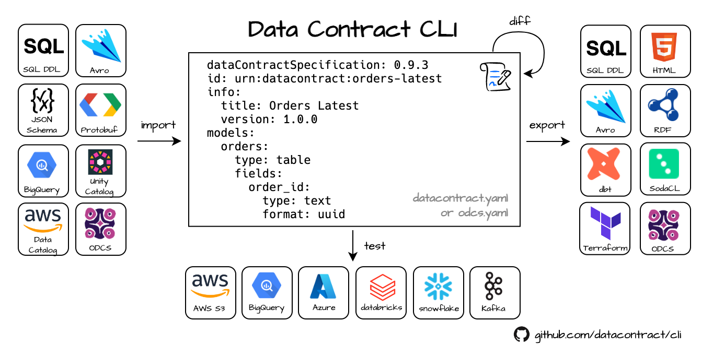

# Data Contract CLI

<p>
  <a href="https://github.com/datacontract/datacontract-cli/actions/workflows/ci.yaml?query=branch%3Amain">
    </a>
  <a href="https://github.com/datacontract/datacontract-cli">
    </a>
  <a href="https://datacontract.com/slack" rel="nofollow"></a>
</p>

The `datacontract` CLI is an open source command-line tool for working with [Data Contracts](https://datacontract.com/).
It uses data contract YAML files to lint the data contract, connect to data sources and execute schema and quality tests, detect breaking changes, and export to different formats. The tool is written in Python. It can be used as a standalone CLI tool, in a CI/CD pipeline, or directly as a Python library.




## Getting started

Let's look at this data contract:
[https://datacontract.com/examples/orders-latest/datacontract.yaml](https://datacontract.com/examples/orders-latest/datacontract.yaml)

We have a _servers_ section with endpoint details to the S3 bucket, _models_ for the structure of the data, _servicelevels_ and _quality_ attributes that describe the expected freshness and number of rows.

This data contract contains all information to connect to S3 and check that the actual data meets the defined schema and quality requirements. We can use this information to test if the actual data set in S3 is compliant to the data contract.

Let's use [pip](https://pip.pypa.io/en/stable/getting-started/) to install the CLI (or use the [Docker image](#docker), if you prefer).
```bash
$ python3 -m pip install datacontract-cli[all]
```


We run the tests:

```bash
$ datacontract test https://datacontract.com/examples/orders-latest/datacontract.yaml

# returns:
Testing https://datacontract.com/examples/orders-latest/datacontract.yaml
╭────────┬─────────────────────────────────────────────────────────────────────┬───────────────────────────────┬─────────╮
│ Result │ Check                                                               │ Field                         │ Details │
├────────┼─────────────────────────────────────────────────────────────────────┼───────────────────────────────┼─────────┤
│ passed │ Check that JSON has valid schema                                    │ orders                        │         │
│ passed │ Check that JSON has valid schema                                    │ line_items                    │         │
│ passed │ Check that field order_id is present                                │ orders                        │         │
│ passed │ Check that field order_timestamp is present                         │ orders                        │         │
│ passed │ Check that field order_total is present                             │ orders                        │         │
│ passed │ Check that field customer_id is present                             │ orders                        │         │
│ passed │ Check that field customer_email_address is present                  │ orders                        │         │
│ passed │ row_count >= 5000                                                   │ orders                        │         │
│ passed │ Check that required field order_id has no null values               │ orders.order_id               │         │
│ passed │ Check that unique field order_id has no duplicate values            │ orders.order_id               │         │
│ passed │ duplicate_count(order_id) = 0                                       │ orders.order_id               │         │
│ passed │ Check that required field order_timestamp has no null values        │ orders.order_timestamp        │         │
│ passed │ freshness(order_timestamp) < 24h                                    │ orders.order_timestamp        │         │
│ passed │ Check that required field order_total has no null values            │ orders.order_total            │         │
│ passed │ Check that required field customer_email_address has no null values │ orders.customer_email_address │         │
│ passed │ Check that field lines_item_id is present                           │ line_items                    │         │
│ passed │ Check that field order_id is present                                │ line_items                    │         │
│ passed │ Check that field sku is present                                     │ line_items                    │         │
│ passed │ values in (order_id) must exist in orders (order_id)                │ line_items.order_id           │         │
│ passed │ row_count >= 5000                                                   │ line_items                    │         │
│ passed │ Check that required field lines_item_id has no null values          │ line_items.lines_item_id      │         │
│ passed │ Check that unique field lines_item_id has no duplicate values       │ line_items.lines_item_id      │         │
╰────────┴─────────────────────────────────────────────────────────────────────┴───────────────────────────────┴─────────╯
🟢 data contract is valid. Run 22 checks. Took 6.739514 seconds.
```

Voilà, the CLI tested that the _datacontract.yaml_ itself is valid, all records comply with the schema, and all quality attributes are met.

We can also use the datacontract.yaml to export in many [formats](#format), e.g., to SQL:

```bash
$ datacontract export --format sql https://datacontract.com/examples/orders-latest/datacontract.yaml

# returns:
-- Data Contract: urn:datacontract:checkout:orders-latest
-- SQL Dialect: snowflake
CREATE TABLE orders (
  order_id TEXT not null primary key,
  order_timestamp TIMESTAMP_TZ not null,
  order_total NUMBER not null,
  customer_id TEXT,
  customer_email_address TEXT not null,
  processed_timestamp TIMESTAMP_TZ not null
);
CREATE TABLE line_items (
  lines_item_id TEXT not null primary key,
  order_id TEXT,
  sku TEXT
);
```

Or generate an HTML export:

```bash
$ datacontract export --format html https://datacontract.com/examples/orders-latest/datacontract.yaml > datacontract.html
```

which will create this [HTML export](https://datacontract.com/examples/orders-latest/datacontract.html).


## Usage

```bash
# create a new data contract from example and write it to datacontract.yaml
$ datacontract init datacontract.yaml

# lint the datacontract.yaml
$ datacontract lint datacontract.yaml

# execute schema and quality checks
$ datacontract test datacontract.yaml

# execute schema and quality checks on the examples within the contract
$ datacontract test --examples datacontract.yaml

# export data contract as html (other formats: avro, dbt, dbt-sources, dbt-staging-sql, jsonschema, odcs, rdf, sql, sodacl, terraform, ...)
$ datacontract export --format html datacontract.yaml > datacontract.html

# import avro (other formats: sql, glue, bigquery...)
$ datacontract import --format avro --source avro_schema.avsc

# find differences between two data contracts
$ datacontract diff datacontract-v1.yaml datacontract-v2.yaml

# find differences between two data contracts categorized into error, warning, and info.
$ datacontract changelog datacontract-v1.yaml datacontract-v2.yaml

# fail pipeline on breaking changes. Uses changelog internally and showing only error and warning.
$ datacontract breaking datacontract-v1.yaml datacontract-v2.yaml
```

## Programmatic (Python)
```python
from datacontract.data_contract import DataContract

data_contract = DataContract(data_contract_file="datacontract.yaml")
run = data_contract.test()
if not run.has_passed():
    print("Data quality validation failed.")
    # Abort pipeline, alert, or take corrective actions...
```


## Installation

Choose the most appropriate installation method for your needs:

### pip
Python 3.11 recommended.
Python 3.12 available as pre-release release candidate for 0.9.3

```bash
python3 -m pip install datacontract-cli[all]
```

### pipx
pipx installs into an isolated environment.
```bash
pipx install datacontract-cli[all]
```

### Docker

```bash
docker pull datacontract/cli
docker run --rm -v ${PWD}:/home/datacontract datacontract/cli
```

Or via an alias that automatically uses the latest version:

```bash
alias datacontract='docker run --rm -v "${PWD}:/home/datacontract" datacontract/cli:latest'
```


## Optional Dependencies

The CLI tool defines several optional dependencies (also known as extras) that can be installed for using with specific servers types.
With _all_, all server dependencies are included.

```bash
pip install datacontract-cli[all]
```

A list of available extras:

| Dependency             | Installation Command                       |
|------------------------|--------------------------------------------|
| Avro Support           | `pip install datacontract-cli[avro]`       |
| Google BigQuery        | `pip install datacontract-cli[bigquery]`   |
| Databricks Integration | `pip install datacontract-cli[databricks]` |
| Kafka Integration      | `pip install datacontract-cli[kafka]`      |
| PostgreSQL Integration | `pip install datacontract-cli[postgres]`   |
| S3 Integration         | `pip install datacontract-cli[s3]`         |
| Snowflake Integration  | `pip install datacontract-cli[snowflake]`  |
| Microsoft SQL Server   | `pip install datacontract-cli[sqlserver]`  |
| Trino                  | `pip install datacontract-cli[trino]`      |
| Dbt                    | `pip install datacontract-cli[dbt]`        |


## Documentation

Commands

- [init](#init)
- [lint](#lint)
- [test](#test)
- [export](#export)
- [import](#import)
- [breaking](#breaking)
- [changelog](#changelog)
- [diff](#diff)
- [catalog](#catalog)
- [publish](#publish)

### init

```
 Usage: datacontract init [OPTIONS] [LOCATION]

 Download a datacontract.yaml template and write it to file.

╭─ Arguments ──────────────────────────────────────────────────────────────────────────────────╮
│   location      [LOCATION]  The location (url or path) of the data contract yaml to create.  │
│                             [default: datacontract.yaml]                                     │
╰──────────────────────────────────────────────────────────────────────────────────────────────╯
╭─ Options ────────────────────────────────────────────────────────────────────────────────────╮
│ --template                       TEXT  URL of a template or data contract                    │
│                                        [default:                                             │
│                                        https://datacontract.com/datacontract.init.yaml]      │
│ --overwrite    --no-overwrite          Replace the existing datacontract.yaml                │
│                                        [default: no-overwrite]                               │
│ --help                                 Show this message and exit.                           │
╰──────────────────────────────────────────────────────────────────────────────────────────────╯
```

### lint

```
 Usage: datacontract lint [OPTIONS] [LOCATION]

 Validate that the datacontract.yaml is correctly formatted.

╭─ Arguments ─────────────────────────────────────────────────────────────────────────────────────────────────────────────────────╮
│   location      [LOCATION]  The location (url or path) of the data contract yaml. [default: datacontract.yaml]                  │
╰─────────────────────────────────────────────────────────────────────────────────────────────────────────────────────────────────╯
╭─ Options ───────────────────────────────────────────────────────────────────────────────────────────────────────────────────────╮
│ --schema        TEXT  The location (url or path) of the Data Contract Specification JSON Schema                                 │
│                       [default: https://datacontract.com/datacontract.schema.json]                                              │
│ --help                Show this message and exit.                                                                               │
╰─────────────────────────────────────────────────────────────────────────────────────────────────────────────────────────────────╯
```

### test

```
 Usage: datacontract test [OPTIONS] [LOCATION]

 Run schema and quality tests on configured servers.

╭─ Arguments ─────────────────────────────────────────────────────────────────────────────────────────────────────────────────────╮
│   location      [LOCATION]  The location (url or path) of the data contract yaml. [default: datacontract.yaml]                  │
╰─────────────────────────────────────────────────────────────────────────────────────────────────────────────────────────────────╯
╭─ Options ───────────────────────────────────────────────────────────────────────────────────────────────────────────────────────╮
│ --schema                                                       TEXT  The location (url or path) of the Data Contract            │
│                                                                      Specification JSON Schema                                  │
│                                                                      [default:                                                  │
│                                                                      https://datacontract.com/datacontract.schema.json]         │
│ --server                                                       TEXT  The server configuration to run the schema and quality     │
│                                                                      tests. Use the key of the server object in the data        │
│                                                                      contract yaml file to refer to a server, e.g.,             │
│                                                                      `production`, or `all` for all servers (default).          │
│                                                                      [default: all]                                             │
│ --examples                    --no-examples                          Run the schema and quality tests on the example data       │
│                                                                      within the data contract.                                  │
│                                                                      [default: no-examples]                                     │
│ --publish                                                      TEXT  The url to publish the results after the test              │
│                                                                      [default: None]                                            │
│ --publish-to-opentelemetry    --no-publish-to-opentelemetry          Publish the results to opentelemetry. Use environment      │
│                                                                      variables to configure the OTLP endpoint, headers, etc.    │
│                                                                      [default: no-publish-to-opentelemetry]                     │
│ --logs                        --no-logs                              Print logs [default: no-logs]                              │
│ --help                                                               Show this message and exit.                                │
╰─────────────────────────────────────────────────────────────────────────────────────────────────────────────────────────────────╯
```

Data Contract CLI connects to a data source and runs schema and quality tests to verify that the data contract is valid.

```bash
$ datacontract test --server production datacontract.yaml
```

To connect to the databases the `server` block in the datacontract.yaml is used to set up the connection.
In addition, credentials, such as username and passwords, may be defined with environment variables.

The application uses different engines, based on the server `type`.
Internally, it connects with DuckDB, Spark, or a native connection and executes the most tests with _soda-core_ and _fastjsonschema_.

Credentials are provided with environment variables.

Supported server types:

- [s3](#S3)
- [bigquery](#bigquery)
- [azure](#azure)
- [sqlserver](#sqlserver)
- [databricks](#databricks)
- [databricks (programmatic)](#databricks-programmatic)
- [dataframe (programmatic)](#dataframe-programmatic)
- [snowflake](#snowflake)
- [kafka](#kafka)
- [postgres](#postgres)
- [trino](#trino)
- [local](#local)

Supported formats:

- parquet
- json
- csv
- delta
- iceberg (coming soon)

Feel free to create an [issue](https://github.com/datacontract/datacontract-cli/issues), if you need support for an additional type and formats.

### S3

Data Contract CLI can test data that is stored in S3 buckets or any S3-compliant endpoints in various formats.

- CSV
- JSON
- Delta
- Parquet
- Iceberg (coming soon)

#### Examples

##### JSON

datacontract.yaml
```yaml
servers:
  production:
    type: s3
    endpointUrl: https://minio.example.com # not needed with AWS S3
    location: s3://bucket-name/path/*/*.json
    format: json
    delimiter: new_line # new_line, array, or none
```

##### Delta Tables

datacontract.yaml
```yaml
servers:
  production:
    type: s3
    endpointUrl: https://minio.example.com # not needed with AWS S3
    location: s3://bucket-name/path/table.delta # path to the Delta table folder containing parquet data files and the _delta_log
    format: delta
```

#### Environment Variables

| Environment Variable                | Example                         | Description                            |
|-------------------------------------|---------------------------------|----------------------------------------|
| `DATACONTRACT_S3_REGION`            | `eu-central-1`                  | Region of S3 bucket                    |
| `DATACONTRACT_S3_ACCESS_KEY_ID`     | `AKIAXV5Q5QABCDEFGH`            | AWS Access Key ID                      |
| `DATACONTRACT_S3_SECRET_ACCESS_KEY` | `93S7LRrJcqLaaaa/XXXXXXXXXXXXX` | AWS Secret Access Key                  |
| `DATACONTRACT_S3_SESSION_TOKEN`     | `AQoDYXdzEJr...`                | AWS temporary session token (optional) |


### Google Cloud Storage (GCS)

The [S3](#S3) integration also works with files on Google Cloud Storage through its [interoperability](https://cloud.google.com/storage/docs/interoperability).
Use `https://storage.googleapis.com` as the endpoint URL.

#### Example

datacontract.yaml
```yaml
servers:
  production:
    type: s3
    endpointUrl: https://storage.googleapis.com
    location: s3://bucket-name/path/*/*.json # use s3:// schema instead of gs://
    format: json
    delimiter: new_line # new_line, array, or none
```

#### Environment Variables

| Environment Variable                | Example        | Description                                                                              |
|-------------------------------------|----------------|------------------------------------------------------------------------------------------|
| `DATACONTRACT_S3_ACCESS_KEY_ID`     | `GOOG1EZZZ...` | The GCS [HMAC Key](https://cloud.google.com/storage/docs/authentication/hmackeys) Key ID |
| `DATACONTRACT_S3_SECRET_ACCESS_KEY` | `PDWWpb...`    | The GCS [HMAC Key](https://cloud.google.com/storage/docs/authentication/hmackeys) Secret |


### BigQuery

We support authentication to BigQuery using Service Account Key. The used Service Account should include the roles:
* BigQuery Job User
* BigQuery Data Viewer


#### Example

datacontract.yaml
```yaml
servers:
  production:
    type: bigquery
    project: datameshexample-product
    dataset: datacontract_cli_test_dataset
models:
  datacontract_cli_test_table: # corresponds to a BigQuery table
    type: table
    fields: ...
```

#### Environment Variables

| Environment Variable                         | Example                   | Description                                             |
|----------------------------------------------|---------------------------|---------------------------------------------------------|
| `DATACONTRACT_BIGQUERY_ACCOUNT_INFO_JSON_PATH` | `~/service-access-key.json` | Service Access key as saved on key creation by BigQuery. If this environment variable isn't set, the cli tries to use `GOOGLE_APPLICATION_CREDENTIALS` as a fallback, so if you have that set for using their Python library anyway, it should work seamlessly. |


### Azure

Data Contract CLI can test data that is stored in Azure Blob storage or Azure Data Lake Storage (Gen2) (ADLS) in various formats.

#### Example

datacontract.yaml
```yaml
servers:
  production:
    type: azure
    location: abfss://datameshdatabricksdemo.dfs.core.windows.net/dataproducts/inventory_events/*.parquet
    format: parquet
```

#### Environment Variables

Authentication works with an Azure Service Principal (SPN) aka App Registration with a secret.

| Environment Variable               | Example                                | Description                                          |
|------------------------------------|----------------------------------------|------------------------------------------------------|
| `DATACONTRACT_AZURE_TENANT_ID`     | `79f5b80f-10ff-40b9-9d1f-774b42d605fc` | The Azure Tenant ID                                  |
| `DATACONTRACT_AZURE_CLIENT_ID`     | `3cf7ce49-e2e9-4cbc-a922-4328d4a58622` | The ApplicationID / ClientID of the app registration |
| `DATACONTRACT_AZURE_CLIENT_SECRET` | `yZK8Q~GWO1MMXXXXXXXXXXXXX`            | The Client Secret value                              |


### Sqlserver

Data Contract CLI can test data in MS SQL Server (including Azure SQL, Synapse Analytics SQL Pool).

#### Example

datacontract.yaml
```yaml
servers:
  production:
    type: sqlserver
    host: localhost
    port: 5432
    database: tempdb
    schema: dbo
    driver: ODBC Driver 18 for SQL Server
models:
  my_table_1: # corresponds to a table
    type: table
    fields:
      my_column_1: # corresponds to a column
        type: varchar
```

#### Environment Variables

| Environment Variable                              | Example| Description                                  |
|---------------------------------------------------|--------|----------------------------------------------|
| `DATACONTRACT_SQLSERVER_USERNAME`                 | `root` | Username                                     |
| `DATACONTRACT_SQLSERVER_PASSWORD`                 | `toor` | Password                                     |
| `DATACONTRACT_SQLSERVER_TRUSTED_CONNECTION`       | `True` | Use windows authentication, instead of login |
| `DATACONTRACT_SQLSERVER_TRUST_SERVER_CERTIFICATE` | `True` | Trust self-signed certificate                |
| `DATACONTRACT_SQLSERVER_ENCRYPTED_CONNECTION`     | `True` | Use SSL                                      |


### Databricks

Works with Unity Catalog and Hive metastore.

Needs a running SQL warehouse or compute cluster.

#### Example

datacontract.yaml
```yaml
servers:
  production:
    type: databricks
    host: dbc-abcdefgh-1234.cloud.databricks.com
    catalog: acme_catalog_prod
    schema: orders_latest
models:
  orders: # corresponds to a table
    type: table
    fields: ...
```

#### Environment Variables

| Environment Variable                         | Example                              | Description                                           |
|----------------------------------------------|--------------------------------------|-------------------------------------------------------|
| `DATACONTRACT_DATABRICKS_TOKEN`              | `dapia00000000000000000000000000000` | The personal access token to authenticate             |
| `DATACONTRACT_DATABRICKS_HTTP_PATH`          | `/sql/1.0/warehouses/b053a3ffffffff` | The HTTP path to the SQL warehouse or compute cluster |


### Databricks (programmatic)

Works with Unity Catalog and Hive metastore.
When running in a notebook or pipeline, the provided `spark` session can be used.
An additional authentication is not required.

Requires a Databricks Runtime with Python >= 3.10.

#### Example

datacontract.yaml
```yaml
servers:
  production:
    type: databricks
    host: dbc-abcdefgh-1234.cloud.databricks.com # ignored, always use current host
    catalog: acme_catalog_prod
    schema: orders_latest
models:
  orders: # corresponds to a table
    type: table
    fields: ...
```

Notebook
```python
%pip install datacontract-cli[databricks]
dbutils.library.restartPython()

from datacontract.data_contract import DataContract

data_contract = DataContract(
  data_contract_file="/Volumes/acme_catalog_prod/orders_latest/datacontract/datacontract.yaml",
  spark=spark)
run = data_contract.test()
run.result
```

### Dataframe (programmatic)

Works with Spark DataFrames.
DataFrames need to be created as named temporary views.
Multiple temporary views are supported if your data contract contains multiple models.

Testing DataFrames is useful to test your datasets in a pipeline before writing them to a data source.

#### Example

datacontract.yaml
```yaml
servers:
  production:
    type: dataframe
models:
  my_table: # corresponds to a temporary view
    type: table
    fields: ...
```

Example code
```python
from datacontract.data_contract import DataContract

df.createOrReplaceTempView("my_table")

data_contract = DataContract(
  data_contract_file="datacontract.yaml",
  spark=spark,
)
run = data_contract.test()
assert run.result == "passed"
```


### Snowflake

Data Contract CLI can test data in Snowflake.

#### Example

datacontract.yaml
```yaml

servers:
  snowflake:
    type: snowflake
    account: abcdefg-xn12345
    database: ORDER_DB
    schema: ORDERS_PII_V2
models:
  my_table_1: # corresponds to a table
    type: table
    fields:
      my_column_1: # corresponds to a column
        type: varchar
```

#### Environment Variables
All [parameters supported by Soda](https://docs.soda.io/soda/connect-snowflake.html), uppercased and prepended by `DATACONTRACT_SNOWFLAKE_` prefix.  
For example:

| Soda parameter       | Environment Variable                        | 
|----------------------|---------------------------------------------|
| `username`           | `DATACONTRACT_SNOWFLAKE_USERNAME`           |
| `password`           | `DATACONTRACT_SNOWFLAKE_PASSWORD`           |
| `warehouse`          | `DATACONTRACT_SNOWFLAKE_WAREHOUSE`          |
| `role`               | `DATACONTRACT_SNOWFLAKE_ROLE`               |
| `connection_timeout` | `DATACONTRACT_SNOWFLAKE_CONNECTION_TIMEOUT` |

Beware, that parameters:
* `account`
* `database`
* `schema`

are obtained from the `servers` section of the YAML-file.  
E.g. from the example above:
```yaml
servers:
  snowflake:
    account: abcdefg-xn12345
    database: ORDER_DB
    schema: ORDERS_PII_V2
```


### Kafka

Kafka support is currently considered experimental.

#### Example

datacontract.yaml
```yaml
servers:
  production:
    type: kafka
    host: abc-12345.eu-central-1.aws.confluent.cloud:9092
    topic: my-topic-name
    format: json
```

#### Environment Variables

| Environment Variable               | Example | Description                 |
|------------------------------------|---------|-----------------------------|
| `DATACONTRACT_KAFKA_SASL_USERNAME` | `xxx`   | The SASL username (key).    |
| `DATACONTRACT_KAFKA_SASL_PASSWORD` | `xxx`   | The SASL password (secret). |


### Postgres

Data Contract CLI can test data in Postgres or Postgres-compliant databases (e.g., RisingWave).

#### Example

datacontract.yaml
```yaml
servers:
  postgres:
    type: postgres
    host: localhost
    port: 5432
    database: postgres
    schema: public
models:
  my_table_1: # corresponds to a table
    type: table
    fields:
      my_column_1: # corresponds to a column
        type: varchar
```

#### Environment Variables

| Environment Variable             | Example            | Description |
|----------------------------------|--------------------|-------------|
| `DATACONTRACT_POSTGRES_USERNAME` | `postgres`         | Username    |
| `DATACONTRACT_POSTGRES_PASSWORD` | `mysecretpassword` | Password    |


### Trino

Data Contract CLI can test data in Trino.

#### Example

datacontract.yaml
```yaml
servers:
  trino:
    type: trino
    host: localhost
    port: 8080
    catalog: my_catalog
    schema: my_schema
models:
  my_table_1: # corresponds to a table
    type: table
    fields:
      my_column_1: # corresponds to a column
        type: varchar
```

#### Environment Variables

| Environment Variable          | Example            | Description |
|-------------------------------|--------------------|-------------|
| `DATACONTRACT_TRINO_USERNAME` | `trino`            | Username    |
| `DATACONTRACT_TRINO_PASSWORD` | `mysecretpassword` | Password    |


### export

```

 Usage: datacontract export [OPTIONS] [LOCATION]

 Convert data contract to a specific format. Prints to stdout or to the specified output file.

╭─ Arguments ────────────────────────────────────────────────────────────────────────────────────────────────────────────────────╮
│   location      [LOCATION]  The location (url or path) of the data contract yaml. [default: datacontract.yaml]                 │
╰────────────────────────────────────────────────────────────────────────────────────────────────────────────────────────────────╯
╭─ Options ──────────────────────────────────────────────────────────────────────────────────────────────────────────────────────╮
│ *  --format        [jsonschema|pydantic-model|sodacl|dbt|dbt-sources|db  The export format. [default: None] [required]         │
│                    t-staging-sql|odcs|rdf|avro|protobuf|great-expectati                                                        │
│                    ons|terraform|avro-idl|sql|sql-query|html|go|bigquer                                                        │
│                    y|dbml|spark|sqlalchemy|data-caterer]                                                                       │
│    --output        PATH                                                  Specify the file path where the exported data will be │
│                                                                          saved. If no path is provided, the output will be     │
│                                                                          printed to stdout.                                    │
│                                                                          [default: None]                                       │
│    --server        TEXT                                                  The server name to export. [default: None]            │
│    --model         TEXT                                                  Use the key of the model in the data contract yaml    │
│                                                                          file to refer to a model, e.g., `orders`, or `all`    │
│                                                                          for all models (default).                             │
│                                                                          [default: all]                                        │
│    --help                                                                Show this message and exit.                           │
╰────────────────────────────────────────────────────────────────────────────────────────────────────────────────────────────────╯
╭─ RDF Options ──────────────────────────────────────────────────────────────────────────────────────────────────────────────────╮
│ --rdf-base        TEXT  [rdf] The base URI used to generate the RDF graph. [default: None]                                     │
╰────────────────────────────────────────────────────────────────────────────────────────────────────────────────────────────────╯
╭─ SQL Options ──────────────────────────────────────────────────────────────────────────────────────────────────────────────────╮
│ --sql-server-type        TEXT  [sql] The server type to determine the sql dialect. By default, it uses 'auto' to automatically │
│                                detect the sql dialect via the specified servers in the data contract.                          │
│                                [default: auto]                                                                                 │
╰────────────────────────────────────────────────────────────────────────────────────────────────────────────────────────────────╯

```

```bash
# Example export data contract as HTML
datacontract export --format html > datacontract.html
```

Available export options:

| Type                 | Description                                             | Status |
|----------------------|---------------------------------------------------------|--------|
| `html`               | Export to HTML                                          | ✅     |
| `jsonschema`         | Export to JSON Schema                                   | ✅     |
| `odcs`               | Export to Open Data Contract Standard (ODCS)            | ✅     |
| `sodacl`             | Export to SodaCL quality checks in YAML format          | ✅     |
| `dbt`                | Export to dbt models in YAML format                     | ✅     |
| `dbt-sources`        | Export to dbt sources in YAML format                    | ✅     |
| `dbt-staging-sql`    | Export to dbt staging SQL models                        | ✅     |
| `rdf`                | Export data contract to RDF representation in N3 format | ✅     |
| `avro`               | Export to AVRO models                                   | ✅     |
| `protobuf`           | Export to Protobuf                                      | ✅     |
| `terraform`          | Export to terraform resources                           | ✅     |
| `sql`                | Export to SQL DDL                                       | ✅     |
| `sql-query`          | Export to SQL Query                                     | ✅     |
| `great-expectations` | Export to Great Expectations Suites in JSON Format      | ✅     |
| `bigquery`           | Export to BigQuery Schemas                              | ✅     |
| `go`                 | Export to Go types                                      | ✅     |
| `pydantic-model`     | Export to pydantic models                               | ✅     |
| `DBML`               | Export to a DBML Diagram description                    | ✅     |
| `spark`              | Export to a Spark StructType                            | ✅     |
| `sqlalchemy`         | Export to SQLAlchemy Models                             | ✅     |
| `data-caterer`       | Export to Data Caterer in YAML format                   | ✅     |
| Missing something?   | Please create an issue on GitHub                        | TBD    |

#### Great Expectations

The export function transforms a specified data contract into a comprehensive Great Expectations JSON suite.
If the contract includes multiple models, you need to specify the names of the model you wish to export.

```shell
datacontract  export datacontract.yaml --format great-expectations --model orders
```

The export creates a list of expectations by utilizing:

- The data from the Model definition with a fixed mapping
- The expectations provided in the quality field for each model (find here the expectations gallery https://greatexpectations.io/expectations/)

#### RDF

The export function converts a given data contract into a RDF representation. You have the option to
add a base_url which will be used as the default prefix to resolve relative IRIs inside the document.

```shell
datacontract export --format rdf --rdf-base https://www.example.com/ datacontract.yaml
```

The data contract is mapped onto the following concepts of a yet to be defined Data Contract
Ontology named https://datacontract.com/DataContractSpecification/ :
- DataContract
- Server
- Model

Having the data contract inside an RDF Graph gives us access the following use cases:
- Interoperability with other data contract specification formats
- Store data contracts inside a knowledge graph
- Enhance a semantic search to find and retrieve data contracts
- Linking model elements to already established ontologies and knowledge
- Using full power of OWL to reason about the graph structure of data contracts
- Apply graph algorithms on multiple data contracts (Find similar data contracts, find "gatekeeper"
data products, find the true domain owner of a field attribute)

#### DBML

The export function converts the logical data types of the datacontract into the specific ones of a concrete Database
if a server is selected via the `--server` option (based on the `type` of that server). If no server is selected, the
logical data types are exported.

#### Spark

The export function converts the data contract specification into a StructType Spark schema. The returned value is a Python code picture of the model schemas.  
Spark DataFrame schema is defined as StructType. For more details about Spark Data Types please see [the spark documentation](https://spark.apache.org/docs/latest/sql-ref-datatypes.html) 

#### Avro

The export function converts the data contract specification into an avro schema. It supports specifying custom avro properties for logicalTypes and default values.

##### Custom Avro Properties

We support a **config map on field level**. A config map may include any additional key-value pairs and support multiple server type bindings.

To specify custom Avro properties in your data contract, you can define them within the `config` section of your field definition. Below is an example of how to structure your YAML configuration to include custom Avro properties, such as `avroLogicalType` and `avroDefault`.

>NOTE: At this moment, we just support [logicalType](https://avro.apache.org/docs/1.11.0/spec.html#Logical+Types) and [default](https://avro.apache.org/docs/1.11.0/spec.htm)

#### Data Caterer

The export function converts the data contract to a data generation task in YAML format that can be 
ingested by [Data Caterer](https://github.com/data-catering/data-caterer). This gives you the 
ability to generate production-like data in any environment based off your data contract.

```shell
datacontract export datacontract.yaml --format data-caterer --model orders
```

You can further customise the way data is generated via adding 
[additional metadata in the YAML](https://data.catering/setup/generator/data-generator/) 
to suit your needs.

#### Example Configuration

```yaml
models:
  orders:
    fields:
      my_field_1:
        description: Example for AVRO with Timestamp (microsecond precision) https://avro.apache.org/docs/current/spec.html#Local+timestamp+%28microsecond+precision%29
        type: long
        example: 1672534861000000  # Equivalent to 2023-01-01 01:01:01 in microseconds
        required: true
        config:
          avroLogicalType: local-timestamp-micros
          avroDefault: 1672534861000000
```

#### Explanation

- **models**: The top-level key that contains different models (tables or objects) in your data contract.
- **orders**: A specific model name. Replace this with the name of your model.
- **fields**: The fields within the model. Each field can have various properties defined.
- **my_field_1**: The name of a specific field. Replace this with your field name.
  - **description**: A textual description of the field.
  - **type**: The data type of the field. In this example, it is `long`.
  - **example**: An example value for the field.
  - **required**: Is this a required field (as opposed to optional/nullable).
  - **config**: Section to specify custom Avro properties.
    - **avroLogicalType**: Specifies the logical type of the field in Avro. In this example, it is `local-timestamp-micros`.
    - **avroDefault**: Specifies the default value for the field in Avro. In this example, it is 1672534861000000 which corresponds to ` 2023-01-01 01:01:01 UTC`.


### import

```
 Usage: datacontract import [OPTIONS]

 Create a data contract from the given source location. Prints to stdout.                                                      
                                                                                                                               
╭─ Options ───────────────────────────────────────────────────────────────────────────────────────────────────────────────────╮
│ *  --format                       [sql|avro|dbt|glue|jsonschema|bigquery|odcs  The format of the source file.               │
│                                   |unity|spark]                                [default: None]                              │
│                                                                                [required]                                   │
│    --source                       TEXT                                         The path to the file or Glue Database that   │
│                                                                                should be imported.                          │
│                                                                                [default: None]                              │
│    --glue-table                   TEXT                                         List of table ids to import from the Glue    │
│                                                                                Database (repeat for multiple table ids,     │
│                                                                                leave empty for all tables in the dataset).  │
│                                                                                [default: None]                              │
│    --bigquery-project             TEXT                                         The bigquery project id. [default: None]     │
│    --bigquery-dataset             TEXT                                         The bigquery dataset id. [default: None]     │
│    --bigquery-table               TEXT                                         List of table ids to import from the         │
│                                                                                bigquery API (repeat for multiple table ids, │
│                                                                                leave empty for all tables in the dataset).  │
│                                                                                [default: None]                              │
│    --unity-table-full-name        TEXT                                         Full name of a table in the unity catalog    │
│                                                                                [default: None]                              │
│    --dbt-model                    TEXT                                         List of models names to import from the dbt  │
│                                                                                manifest file (repeat for multiple models    │
│                                                                                names, leave empty for all models in the     │
│                                                                                dataset).                                    │
│                                                                                [default: None]                              │
│    --dbml-schema                  TEXT                                         List of schema names to import from the DBML │
│                                                                                file (repeat for multiple schema names,      │
│                                                                                leave empty for all tables in the file).     │
│                                                                                [default: None]                              │
│    --dbml-table                   TEXT                                         List of table names to import from the DBML  │
│                                                                                file (repeat for multiple table names, leave │
│                                                                                empty for all tables in the file).           │
│                                                                                [default: None]                              │
│    --help                                                                      Show this message and exit.                  │
╰─────────────────────────────────────────────────────────────────────────────────────────────────────────────────────────────╯
```

Example:
```bash
# Example import from SQL DDL
datacontract import --format sql --source my_ddl.sql
```

Available import options:

| Type               | Description                                    | Status |
|--------------------|------------------------------------------------|--------|
| `sql`              | Import from SQL DDL                            | ✅      |
| `avro`             | Import from AVRO schemas                       | ✅      |
| `glue`             | Import from AWS Glue DataCatalog               | ✅      |
| `jsonschema`       | Import from JSON Schemas                       | ✅      |
| `bigquery`         | Import from BigQuery Schemas                   | ✅      |
| `unity`            | Import from Databricks Unity Catalog           | partial |
| `dbt`              | Import from dbt models                         | ✅      |
| `odcs`             | Import from Open Data Contract Standard (ODCS) | ✅      |
| `spark`            | Import from Spark StructTypes                  | ✅      |
| `dbml`             | Import from DBML models                        | ✅      |
| `protobuf`         | Import from Protobuf schemas                   | TBD    |
| Missing something? | Please create an issue on GitHub               | TBD    |


#### BigQuery

Bigquery data can either be imported off of JSON Files generated from the table descriptions or directly from the Bigquery API. In case you want to use JSON Files, specify the `source` parameter with a path to the JSON File.

To import from the Bigquery API, you have to _omit_ `source` and instead need to provide `bigquery-project` and `bigquery-dataset`. Additionally you may specify `bigquery-table` to enumerate the tables that should be imported. If no tables are given, _all_ available tables of the dataset will be imported.

For providing authentication to the Client, please see [the google documentation](https://cloud.google.com/docs/authentication/provide-credentials-adc#how-to) or the one [about authorizing client libraries](https://cloud.google.com/bigquery/docs/authentication#client-libs).

Examples:

```bash
# Example import from Bigquery JSON
datacontract import --format bigquery --source my_bigquery_table.json
```

```bash
# Example import from Bigquery API with specifying the tables to import
datacontract import --format bigquery --bigquery-project <project_id> --bigquery-dataset <dataset_id> --bigquery-table <tableid_1> --bigquery-table <tableid_2> --bigquery-table <tableid_3>
```

```bash
# Example import from Bigquery API importing all tables in the dataset
datacontract import --format bigquery --bigquery-project <project_id> --bigquery-dataset <dataset_id>
```

#### Unity Catalog

```bash
# Example import from a Unity Catalog JSON file
datacontract import --format unity --source my_unity_table.json
```

```bash
# Example import single table from Unity Catalog via HTTP endpoint
export DATABRICKS_IMPORT_INSTANCE="https://xyz.cloud.databricks.com"
export DATABRICKS_IMPORT_ACCESS_TOKEN=<token>
datacontract import --format unity --unity-table-full-name <table_full_name>
```

#### dbt

Importing from dbt manifest file.
You may give the `dbt-model` parameter to enumerate the tables that should be imported. If no tables are given, _all_ available tables of the database will be imported.

Examples:

```bash
# Example import from dbt manifest with specifying the tables to import
datacontract import --format dbt --source <manifest_path> --dbt-model <model_name_1> --dbt-model <model_name_2> --dbt-model <model_name_3>
```

```bash
# Example import from dbt manifest importing all tables in the database
datacontract import --format dbt --source <manifest_path>
```

#### Glue

Importing from Glue reads the necessary Data directly off of the AWS API.
You may give the `glue-table` parameter to enumerate the tables that should be imported. If no tables are given, _all_ available tables of the database will be imported.

Examples:

```bash
# Example import from AWS Glue with specifying the tables to import
datacontract import --format glue --source <database_name> --glue-table <table_name_1> --glue-table <table_name_2> --glue-table <table_name_3>
```

```bash
# Example import from AWS Glue importing all tables in the database
datacontract import --format glue --source <database_name>
```

#### Spark

Importing from Spark table or view these must be created or accessible in the Spark context. Specify tables list in `source` parameter.

Example:

```bash
datacontract import --format spark --source "users,orders"
```

#### DBML

Importing from DBML Documents.
**NOTE:** Since DBML does _not_ have strict requirements on the types of columns, this import _may_ create non-valid datacontracts, as not all types of fields can be properly mapped. In this case you will have to adapt the generated document manually.
We also assume, that the description for models and fields is stored in a Note within the DBML model.

You may give the `dbml-table` or `dbml-schema` parameter to enumerate the tables or schemas that should be imported. 
If no tables are given, _all_ available tables of the source will be imported. Likewise, if no schema is given, _all_ schemas are imported.

Examples:

```bash
# Example import from DBML file, importing everything
datacontract import --format dbml --source <file_path>
```

```bash
# Example import from DBML file, filtering for tables from specific schemas
datacontract import --format dbml --source <file_path> --dbml-schema <schema_1> --dbml-schema <schema_2>
```

```bash
# Example import from DBML file, filtering for tables with specific names
datacontract import --format dbml --source <file_path> --dbml-table <table_name_1> --dbml-table <table_name_2>
```

```bash
# Example import from DBML file, filtering for tables with specific names from a specific schema
datacontract import --format dbml --source <file_path> --dbml-table <table_name_1> --dbml-schema <schema_1>
```


### breaking

```
 Usage: datacontract breaking [OPTIONS] LOCATION_OLD LOCATION_NEW

 Identifies breaking changes between data contracts. Prints to stdout.

╭─ Arguments ───────────────────────────────────────────────────────────────────────────────────────────────────────────────╮
│ *    location_old      TEXT  The location (url or path) of the old data contract yaml. [default: None] [required]         │
│ *    location_new      TEXT  The location (url or path) of the new data contract yaml. [default: None] [required]         │
╰───────────────────────────────────────────────────────────────────────────────────────────────────────────────────────────╯
╭─ Options ─────────────────────────────────────────────────────────────────────────────────────────────────────────────────╮
│ --help          Show this message and exit.                                                                               │
╰───────────────────────────────────────────────────────────────────────────────────────────────────────────────────────────╯
```

### changelog

```
 Usage: datacontract changelog [OPTIONS] LOCATION_OLD LOCATION_NEW

 Generate a changelog between data contracts. Prints to stdout.

╭─ Arguments ───────────────────────────────────────────────────────────────────────────────────────────────────────────────╮
│ *    location_old      TEXT  The location (url or path) of the old data contract yaml. [default: None] [required]         │
│ *    location_new      TEXT  The location (url or path) of the new data contract yaml. [default: None] [required]         │
╰───────────────────────────────────────────────────────────────────────────────────────────────────────────────────────────╯
╭─ Options ─────────────────────────────────────────────────────────────────────────────────────────────────────────────────╮
│ --help          Show this message and exit.                                                                               │
╰───────────────────────────────────────────────────────────────────────────────────────────────────────────────────────────╯
```

### diff

```
 Usage: datacontract diff [OPTIONS] LOCATION_OLD LOCATION_NEW

 PLACEHOLDER. Currently works as 'changelog' does.

╭─ Arguments ───────────────────────────────────────────────────────────────────────────────────────────────────────────────╮
│ *    location_old      TEXT  The location (url or path) of the old data contract yaml. [default: None] [required]         │
│ *    location_new      TEXT  The location (url or path) of the new data contract yaml. [default: None] [required]         │
╰───────────────────────────────────────────────────────────────────────────────────────────────────────────────────────────╯
╭─ Options ─────────────────────────────────────────────────────────────────────────────────────────────────────────────────╮
│ --help          Show this message and exit.                                                                               │
╰───────────────────────────────────────────────────────────────────────────────────────────────────────────────────────────╯
```

### catalog

```

 Usage: datacontract catalog [OPTIONS]

 Create an html catalog of data contracts.

╭─ Options ────────────────────────────────────────────────────────────────────────────────────────────────────────────────╮
│ --files         TEXT  Glob pattern for the data contract files to include in the catalog. [default: *.yaml]              │
│ --output        TEXT  Output directory for the catalog html files. [default: catalog/]                                   │
│ --help                Show this message and exit.                                                                        │
╰──────────────────────────────────────────────────────────────────────────────────────────────────────────────────────────╯
```

### Publish

```

 Usage: datacontract publish [OPTIONS] [LOCATION]

 Publish the data contract to the Data Mesh Manager.

╭─ Arguments ────────────────────────────────────────────────────────────────────────────────────────────────────────────────╮
│   location      [LOCATION]  The location (url or path) of the data contract yaml. [default: datacontract.yaml]             │
╰────────────────────────────────────────────────────────────────────────────────────────────────────────────────────────────╯
╭─ Options ──────────────────────────────────────────────────────────────────────────────────────────────────────────────────╮
│ --help          Show this message and exit.                                                                                │
╰────────────────────────────────────────────────────────────────────────────────────────────────────────────────────────────╯
```

## Integrations

| Integration           | Option                       | Description                                                                                                   |
|-----------------------|------------------------------|---------------------------------------------------------------------------------------------------------------|
| Data Mesh Manager     | `--publish`                  | Push full results to the [Data Mesh Manager API](https://api.datamesh-manager.com/swagger/index.html)         |
| Data Contract Manager | `--publish`                  | Push full results to the [Data Contract Manager API](https://api.datacontract-manager.com/swagger/index.html) |
| OpenTelemetry         | `--publish-to-opentelemetry` | Push result as gauge metrics                                                                                  |

### Integration with Data Mesh Manager

If you use [Data Mesh Manager](https://datamesh-manager.com/) or [Data Contract Manager](https://datacontract-manager.com/), you can use the data contract URL and append the `--publish` option to send and display the test results. Set an environment variable for your API key.

```bash
# Fetch current data contract, execute tests on production, and publish result to data mesh manager
$ EXPORT DATAMESH_MANAGER_API_KEY=xxx
$ datacontract test https://demo.datamesh-manager.com/demo279750347121/datacontracts/4df9d6ee-e55d-4088-9598-b635b2fdcbbc/datacontract.yaml \ 
 --server production \
 --publish https://api.datamesh-manager.com/api/test-results
```

### Integration with OpenTelemetry

If you use OpenTelemetry, you can use the data contract URL and append the `--publish-to-opentelemetry` option to send the test results to your OLTP-compatible instance, e.g., Prometheus.

The metric name is "datacontract.cli.test.result" and it uses the following encoding for the result:

| datacontract.cli.test.result | Description                           |
|------------------------------|---------------------------------------|
| 0                            | test run passed, no warnings          |
| 1                            | test run has warnings                 |
| 2                            | test run failed                       |
| 3                            | test run not possible due to an error |
| 4                            | test status unknown                   |


```bash
# Fetch current data contract, execute tests on production, and publish result to open telemetry
$ EXPORT OTEL_SERVICE_NAME=datacontract-cli
$ EXPORT OTEL_EXPORTER_OTLP_ENDPOINT=https://YOUR_ID.apm.westeurope.azure.elastic-cloud.com:443
$ EXPORT OTEL_EXPORTER_OTLP_HEADERS=Authorization=Bearer%20secret # Optional, when using SaaS Products
$ EXPORT OTEL_EXPORTER_OTLP_PROTOCOL=http/protobuf # Optional, default is http/protobuf - use value grpc to use the gRPC protocol instead
# Send to OpenTelemetry
$ datacontract test https://demo.datamesh-manager.com/demo279750347121/datacontracts/4df9d6ee-e55d-4088-9598-b635b2fdcbbc/datacontract.yaml --server production --publish-to-opentelemetry
```

Current limitations:
- currently, only ConsoleExporter and OTLP Exporter
- Metrics only, no logs yet (but loosely planned)


## Best Practices

We share best practices in using the Data Contract CLI.

### Data-first Approach

Create a data contract based on the actual data. This is the fastest way to get started and to get feedback from the data consumers.

1. Use an existing physical schema (e.g., SQL DDL) as a starting point to define your logical data model in the contract. Double check right after the import whether the actual data meets the imported logical data model. Just to be sure.
    ```bash
    $ datacontract import --format sql --source ddl.sql
    $ datacontract test
    ```

2. Add examples to the `datacontract.yaml`. If you can, use actual data and anonymize. Make sure that the examples match the imported logical data model.
   ```bash
   $ datacontract test --examples
   ```


3. Add quality checks and additional type constraints one by one to the contract and make sure the examples and the actual data still adheres to the contract. Check against examples for a very fast feedback loop.
   ```bash
   $ datacontract test --examples
   $ datacontract test
   ```

4. Make sure that all the best practices for a `datacontract.yaml` are met using the linter. You probably forgot to document some fields and add the terms and conditions.
   ```bash
   $ datacontract lint
   ```

5. Set up a CI pipeline that executes daily and reports the results to the [Data Mesh Manager](https://datamesh-manager.com). Or to some place else. You can even publish to any opentelemetry compatible system.
   ```bash
   $ datacontract test --publish https://api.datamesh-manager.com/api/test-results
   ```

### Contract-First

Create a data contract based on the requirements from use cases.

1. Start with a `datacontract.yaml` template.
   ```bash
   $ datacontract init
   ```

2. Add examples to the `datacontract.yaml`. Do not start with the data model, although you are probably tempted to do that. Examples are the fastest way to get feedback from everybody and not loose someone in the discussion.

3. Create the model based on the examples. Test the model against the examples to double-check whether the model matches the examples.
    ```bash
    $ datacontract test --examples
    ```

4. Add quality checks and additional type constraints one by one to the contract and make sure the examples and the actual data still adheres to the contract. Check against examples for a very fast feedback loop.
    ```bash
    $ datacontract test --examples
    ```

5. Fill in the terms, descriptions, etc. Make sure you follow all best practices for a `datacontract.yaml` using the linter.
    ```bash
    $ datacontract lint
    ```

6. Set up a CI pipeline that lints and tests the examples so you make sure that any changes later do not decrease the quality of the contract.
    ```bash
    $ datacontract lint
    $ datacontract test --examples
    ```

7. Use the export function to start building the providing data product as well as the integration into the consuming data products.
    ```bash
    # data provider
    $ datacontract export --format dbt
    # data consumer
    $ datacontract export --format dbt-sources
    $ datacontract export --format dbt-staging-sql
    ```

### Schema Evolution

#### Non-breaking Changes
Examples: adding models or fields

- Add the models or fields in the datacontract.yaml
- Increment the minor version of the datacontract.yaml on any change. Simply edit the datacontract.yaml for this.
- You need a policy that these changes are non-breaking. That means that one cannot use the star expression in SQL to query a table under contract. Make the consequences known.
- Fail the build in the Pull Request if a datacontract.yaml accidentally adds a breaking change even despite only a minor version change
   ```bash
  $ datacontract breaking datacontract-from-pr.yaml datacontract-from-main.yaml
  ```
- Create a changelog of this minor change.
   ```bash
  $ datacontract changelog datacontract-from-pr.yaml datacontract-from-main.yaml
  ```
#### Breaking Changes
Examples: Removing or renaming models and fields.

- Remove or rename models and fields in the datacontract.yaml, and any other change that might be part of this new major version of this data contract.
- Increment the major version of the datacontract.yaml for this and create a new file for the major version. The reason being, that one needs to offer an upgrade path for the data consumers from the old to the new major version.
- As data consumers need to migrate, try to reduce the frequency of major versions by making multiple breaking changes together if possible.
- Be aware of the notice period in the data contract as this is the minimum amount of time you have to offer both the old and the new version for a migration path.
- Do not fear making breaking changes with data contracts. It's okay to do them in this controlled way. Really!
- Create a changelog of this major change.
   ```bash
  $ datacontract changelog datacontract-from-pr.yaml datacontract-from-main.yaml
  ```

## Customizing Exporters and Importers
 
### Custom Exporter
Using the exporter factory to add a new custom exporter
```python

from datacontract.data_contract import DataContract
from datacontract.export.exporter import Exporter
from datacontract.export.exporter_factory import exporter_factory


# Create a custom class that implements export method
class CustomExporter(Exporter):
    def export(self, data_contract, model, server, sql_server_type, export_args) -> dict:
        result = {
            "title": data_contract.info.title,
            "version": data_contract.info.version,
            "description": data_contract.info.description,
            "email": data_contract.info.contact.email,
            "url": data_contract.info.contact.url,
            "model": model,
            "model_columns": ", ".join(list(data_contract.models.get(model).fields.keys())),
            "export_args": export_args,
            "custom_args": export_args.get("custom_arg", ""),
        }
        return result


# Register the new custom class into factory
exporter_factory.register_exporter("custom", CustomExporter)


if __name__ == "__main__":
    # Create a DataContract instance
    data_contract = DataContract(
        data_contract_file="/path/datacontract.yaml"
    )
    # Call export
    result = data_contract.export(
        export_format="custom", model="orders", server="production", custom_arg="my_custom_arg"
    )
    print(result)

```
Output
```python
{
 'title': 'Orders Unit Test', 
 'version': '1.0.0', 
 'description': 'The orders data contract', 
 'email': 'team-orders@example.com', 
 'url': 'https://wiki.example.com/teams/checkout', 
 'model': 'orders', 
 'model_columns': 'order_id, order_total, order_status', 
 'export_args': {'server': 'production', 'custom_arg': 'my_custom_arg'}, 
 'custom_args': 'my_custom_arg'
}
```
  
### Custom Importer
Using the importer factory to add a new custom importer
```python

from datacontract.model.data_contract_specification import DataContractSpecification, Field, Model
from datacontract.data_contract import DataContract
from datacontract.imports.importer import Importer
from datacontract.imports.importer_factory import importer_factory

import json

# Create a custom class that implements import_source method
class CustomImporter(Importer):
    def import_source(
        self, data_contract_specification: DataContractSpecification, source: str, import_args: dict
    ) -> dict:
        source_dict = json.loads(source)
        data_contract_specification.id = source_dict.get("id_custom")
        data_contract_specification.info.title = source_dict.get("title")
        data_contract_specification.info.version = source_dict.get("version")
        data_contract_specification.info.description = source_dict.get("description_from_app")
        
        for model in source_dict.get("models", []):
            fields = {}
            for column in model.get('columns'):
                field = Field(
                    description=column.get('column_description'), 
                    type=column.get('type') 
                )
                fields[column.get('name')] = field               
                   
            dc_model = Model(
                description=model.get('description'), 
                fields= fields
            )

            data_contract_specification.models[model.get('name')] = dc_model
        return data_contract_specification
 

# Register the new custom class into factory
importer_factory.register_importer("custom_company_importer", CustomImporter)


if __name__ == "__main__":
    # Get a custom data from other app 
    json_from_custom_app = '''
    {
        "id_custom": "uuid-custom",
        "version": "0.0.2",
        "title": "my_custom_imported_data",
        "description_from_app": "Custom contract description",
        "models": [
            {
            "name": "model1",
            "description": "model description from app",
            "columns": [
                {
                "name": "columnA",
                "type": "varchar",
                "column_description": "my_column description"
                },
                {
                "name": "columnB",
                "type": "varchar",
                "column_description": "my_columnB description"
                }
            ]
            }
        ]
        }
    '''
    # Create a DataContract instance
    data_contract = DataContract()

    # Call import_from_source
    result = data_contract.import_from_source(
        format="custom_company_importer", 
        data_contract_specification=DataContract.init(), 
        source=json_from_custom_app
    ) 
    print(result.to_yaml() )
```
Output
  
```yaml
dataContractSpecification: 0.9.3
id: uuid-custom
info:
  title: my_custom_imported_data
  version: 0.0.2
  description: Custom contract description
models:
  model1:
    fields:
      columnA:
        type: varchar
        description: my_column description
      columnB:
        type: varchar
        description: my_columnB description

```
## Development Setup

Python base interpreter should be 3.11.x (unless working on 3.12 release candidate).

```bash
# create venv
python3 -m venv venv
source venv/bin/activate

# Install Requirements
pip install --upgrade pip setuptools wheel
pip install -e '.[dev]'
pre-commit install
pre-commit run --all-files
pytest
```


### Docker Build

```bash
docker build -t datacontract/cli .
docker run --rm -v ${PWD}:/home/datacontract datacontract/cli
```

#### Docker compose integration

We've included a [docker-compose.yml](./docker-compose.yml) configuration to simplify the build, test, and deployment of the image.

##### Building the Image with Docker Compose

To build the Docker image using Docker Compose, run the following command:

```bash
docker compose build
```

This command utilizes the `docker-compose.yml` to build the image, leveraging predefined settings such as the build context and Dockerfile location. This approach streamlines the image creation process, avoiding the need for manual build specifications each time.

#### Testing the Image

After building the image, you can test it directly with Docker Compose:

```bash
docker compose run --rm datacontract --version
```

This command runs the container momentarily to check the version of the `datacontract` CLI. The `--rm` flag ensures that the container is automatically removed after the command executes, keeping your environment clean.

## Use with pre-commit

To run `datacontract-cli` as part of a [pre-commit](https://pre-commit.com/) workflow, add something like the below to the `repos` list in the project's `.pre-commit-config.yaml`:

```yaml
repos:
  - repo: https://github.com/datacontract/datacontract-cli
    rev: "v0.10.9"
    hooks:
      - id: datacontract-lint
      - id: datacontract-test
        args: ["--server", "production"]
```

### Available Hook IDs

| Hook ID           | Description                                        | Dependency |
| ----------------- | -------------------------------------------------- | ---------- |
| datacontract-lint | Runs the lint subcommand.                          | Python3    |
| datacontract-test | Runs the test subcommand. Please look at           | Python3    |
|                   | [test](#test) section for all available arguments. |            |

## Release Steps

1. Update the version in `pyproject.toml`
2. Have a look at the `CHANGELOG.md`
3. Create release commit manually
4. Execute `./release`
5. Wait until GitHub Release is created
6. Add the release notes to the GitHub Release

## Contribution

We are happy to receive your contributions. Propose your change in an issue or directly create a pull request with your improvements.

## Companies using this tool

- [INNOQ](https://innoq.com)
- [Data Catering](https://data.catering/)
- And many more. To add your company, please create a pull request.

## Related Tools

- [Data Contract Manager](https://www.datacontract-manager.com/) is a commercial tool to manage data contracts. It contains a web UI, access management, and data governance for a full enterprise data marketplace.
- [Data Contract GPT](https://gpt.datacontract.com) is a custom GPT that can help you write data contracts.
- [Data Contract Editor](https://editor.datacontract.com) is an editor for Data Contracts, including a live html preview.
- [Data Contract Playground](https://data-catering.github.io/data-contract-playground/) allows you to validate and export your data contract to different formats within your browser.

## License

[MIT License](LICENSE)

## Credits

Created by [Stefan Negele](https://www.linkedin.com/in/stefan-negele-573153112/) and [Jochen Christ](https://www.linkedin.com/in/jochenchrist/).


<a href="https://github.com/datacontract/datacontract-cli" class="github-corner" aria-label="View source on GitHub"><svg width="80" height="80" viewBox="0 0 250 250" style="fill:#151513; color:#fff; position: absolute; top: 0; border: 0; right: 0;" aria-hidden="true"><path d="M0,0 L115,115 L130,115 L142,142 L250,250 L250,0 Z"></path><path d="M128.3,109.0 C113.8,99.7 119.0,89.6 119.0,89.6 C122.0,82.7 120.5,78.6 120.5,78.6 C119.2,72.0 123.4,76.3 123.4,76.3 C127.3,80.9 125.5,87.3 125.5,87.3 C122.9,97.6 130.6,101.9 134.4,103.2" fill="currentColor" style="transform-origin: 130px 106px;" class="octo-arm"></path><path d="M115.0,115.0 C114.9,115.1 118.7,116.5 119.8,115.4 L133.7,101.6 C136.9,99.2 139.9,98.4 142.2,98.6 C133.8,88.0 127.5,74.4 143.8,58.0 C148.5,53.4 154.0,51.2 159.7,51.0 C160.3,49.4 163.2,43.6 171.4,40.1 C171.4,40.1 176.1,42.5 178.8,56.2 C183.1,58.6 187.2,61.8 190.9,65.4 C194.5,69.0 197.7,73.2 200.1,77.6 C213.8,80.2 216.3,84.9 216.3,84.9 C212.7,93.1 206.9,96.0 205.4,96.6 C205.1,102.4 203.0,107.8 198.3,112.5 C181.9,128.9 168.3,122.5 157.7,114.1 C157.9,116.9 156.7,120.9 152.7,124.9 L141.0,136.5 C139.8,137.7 141.6,141.9 141.8,141.8 Z" fill="currentColor" class="octo-body"></path></svg></a><style>.github-corner:hover .octo-arm{animation:octocat-wave 560ms ease-in-out}@keyframes octocat-wave{0%,100%{transform:rotate(0)}20%,60%{transform:rotate(-25deg)}40%,80%{transform:rotate(10deg)}}@media (max-width:500px){.github-corner:hover .octo-arm{animation:none}.github-corner .octo-arm{animation:octocat-wave 560ms ease-in-out}}</style>
