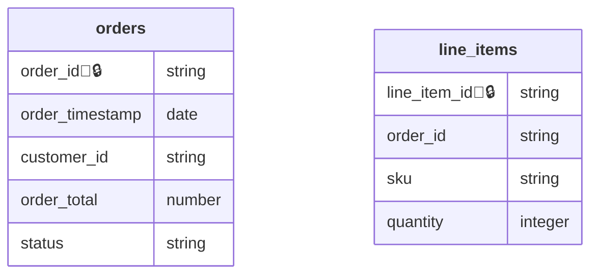

# Export: Mermaid

Generates a [Mermaid](https://mermaid.js.org/) entity-relationship diagram of the contract's schemas.

{/* AUTOGENERATED EXAMPLE: do not edit by hand; regenerate with the update script. */}

```bash
datacontract export mermaid orders.odcs.yaml
```

Running this against the [example `orders` contract](https://github.com/datacontract/datacontract-cli/blob/main/examples/orders/orders.odcs.yaml) produces:



{/* END AUTOGENERATED EXAMPLE */}
